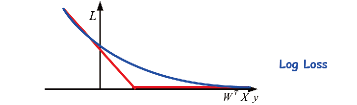

> ## 声明
>
> 阅读本文件即视为同意以下内容：
>
> 1. **禁止商业用途**
>    - 本文件及其任何基于本文件的修改版本不得在任何情况下用于商业目的，亦不得作为盈利项目的一部分。
>
> 2. **开源共享与修改权限**
>    - 本文件以 Markdown 格式提供源文件，允许任何人根据自身需求进行修改。
>    - 若修改后的版本需要进行传播，必须保留本声明并明确标注修改内容。
>
> 3. **免责声明**
>    - 尽管文件内容已由作者校对，但作者对内容的准确性不作任何保证。
>    - 使用本文件所造成的任何后果，均由使用者自行承担，作者不承担任何责任。
>
> 4. **反馈与改进建议**
>    - 若发现内容存在错误、不明确或需要改进之处，欢迎通过以下方式联系作者：
>      - 在 GitHub 页面提交 Pull Request。
>      - 通过电子邮件联系作者。
>
> 5. **内容来源说明**
>    - 本文件部分内容参考自流传的 2021 年版模式识别复习资料，但原作者信息不详。如有知情者，请联系作者以便致谢。
>
> ### 联系方式
> - GitHub 主页：[Click Here](https://github.com/ympan0508/bit-statistical-pattern-recognition)
> - 作者邮箱：[ympan0508@gmail.com](mailto:ympan0508@gmail.com)


### Preliminaries

正态分布
$$
f(x) = \frac{1}{\sqrt{2\pi \sigma^2}} \exp\left( -\frac{(x - \mu)^2}{2\sigma^2} \right)\\
f(\mathbf{x}) = \frac{1}{(2\pi)^{d/2} |\mathbf{\Sigma}|^{1/2}} \exp\left( -\frac{1}{2} (\mathbf{x} - \boldsymbol{\mu})^T \mathbf{\Sigma}^{-1} (\mathbf{x} - \boldsymbol{\mu}) \right)
$$

条件概率
$$
P[A|B] = \frac{P(A\bigcap B)}{P(B)}, P(B)>0
$$
全概率展开
$$
\begin{aligned}
    P[A]&=P[A\bigcap B_1]+P[A\bigcap B_2]+\cdots+P[A\bigcap B_N]\\
    &=P[A|B_1]P[B_1]+P[A|B_2]P[B_2]+\cdots+P[A|B_N]P[B_N]\\
    &=\sum_{k=1}^{N}P[A|B_k]P[B_k]
\end{aligned}\\
$$
贝叶斯公式
$$
\begin{aligned}
    P[B_j|A] &= \frac{P(A\bigcap B_j)}{P[A]}\\
    &=\frac{P[A|B_j]P[B_j]}{\sum_{k=1}^N P[A|B_k]P[B_k]}
\end{aligned}
$$
概率密度函数
$$
f_X(X)=\frac{dF_X(X)}{dX}
$$
期望
$$
E[X]=\mu=\int_{-\infty}^{+\infty}Xf_X(X)dX
$$
方差
$$
\text{Var}[X]=E[(X-E(X))^2]=\int_{-\infty}^{+\infty}(X-\mu)^2f_X(X)dX
$$
N阶矩
$$
E[X_N]=\int_{X}X^Nf_X(X)dX
$$
边缘分布
$$
f_{X_1}(X_1)=\int_{X_2}f_{X_1X_2}(X_1X_2)dX_2
$$
协方差矩阵
$$
\begin{aligned}
\text{Cov}[X] &= \Sigma = E[(X-\mu)(X-\mu)^T]\\
&=
\begin{bmatrix}
E[(X_1-\mu_1)(X_1-\mu_1)^T] & \dots & E[(X_1-\mu_1)(X_N-\mu_N)^T]\\ 
\dots & \dots & \dots\\ 
E[(X_N-\mu_N)(X_1-\mu_1)^T] & \dots & E[(X_N-\mu_N)(X_N-\mu_N)^T]
\end{bmatrix}
=\begin{bmatrix}
\sigma_1^2 & \dots & C_{1N}\\ 
\dots & \dots & \dots\\ 
C_{1N} & \dots & \sigma_N^2
\end{bmatrix}
\end{aligned}
$$
矩阵求导公式（from wiki）


### Lec 00 Course Overview


### Lec 01 Introduction

模式是混沌的对立面 “A pattern is the **opposite of a chaos**; it is an entity vaguely defined, that could be given a name.” (Watanabe)

识别指将一种模式划归为我们已知的某一种类中的一个，包括：
分类Classification - 已知类别 - 监督学习
聚类Clustering - 未知（待学习）类别 - 无监督学习

模式识别主要是用来进行自主决策和协助人做决策

模式识别系统：领域知识domain specific knowledge -> 数据获取data acquisition -> 预处理preprocessing -> 表征representation -> 决策decision making -> 后处理post-processing/使用场景use of context

系统性能：（分类）错误率error rate; 速度speed/吞吐率throughput；代价cost；鲁棒性robustness；拒绝选项reject option；投资回报率return on investment

良好的表征：具有一定的不变性（如旋转rotation、平移translation、缩放scale后保持不变）；考虑类内多样性intra-class variations；类间区分性discriminate pattern classes of interest；对噪声noise、遮挡occlusion等情况保持鲁棒；决策简单化（例如线性决策边界）；低计算代价、实时性


### Lec 02-1 Bayesian Decision Theory

生成式分类：对于每个候选类，建模其条件密度函数 $f = p(x|y_i)$ 和类先验 $p(y_i)$，通过贝叶斯公式评估其后验概率 $p(y_i|x)=\frac{p(y_i)p(x|y_i)}{p(x)}$（因为显式建模了条件密度函数，可以直接生成数据样本，也能解释一个输入数据的生成概率/是否异常）

判别式分类：直接建模后验概率$p(y_i|x)$ 预测并决策


最大后验准则MAP：最大化后验概率$\max_i g_i(x)=\max_i p(\omega_i|x)$，实际上是Bayes准则中$C_{ij} = [i\ne j]$的特殊情况

最大似然准则ML：最大化似然概率$\max_i g_i(x)=\max_i p(x|\omega_i)$，实际上是MAP忽略了先验（认为他们一致）的特殊情况$\max_i p(\omega_i|x)=\max_i \frac{\cancel{p(\omega_i)}p(x|\omega_i)}{p(x)} = \max_i p(x|\omega_i)$（$p(x)$与$i$无关）

贝叶斯准则Bayes：最小化贝叶斯（期望）风险$\max_i g_i(x) = \max_i -\mathfrak{R}= \min_i \mathfrak{R}(\alpha_i|x)=\min_i\sum_j C_{ij}P(\omega_j|x)$，其中$C_{ij}$指把$\omega_j$错分为$\omega_i$的代价，这里$\alpha_i$指的是将输入预测为$\omega_i$所对应的决策

Neyman-Pearson准则：保持一类错误的概率$\alpha$不超过某个阈值的条件下，最小化另一类错误的概率，例如对于二分类任务有$\min P(\text{True Negative}) \;s.t. P(\text{False Positive}) \le \alpha$（控制误诊率的前提下，最小化漏诊率）

Mini-Max准则：最小化潜在最大风险$\min_i (\max_j C_{ij}P(\omega_j|x))$（有行人未刹车的潜在风险$\gg$无行人但刹车的潜在风险，取前者作为判准）

**注意**：本章中的决策准则都是指**模型以及参数（也即概率分布已知）**都已确定的情况下，推测阶段（测试阶段）所采用的准则。而在参数估计那一章中，点估计所用到的最大似然等法则，则是用于估计未知参数。前者是已知模型、参数，给定数据，求Y；而后者是已知模型、给定数据对（x，y），求参数。注意区别这两种情况。


二分类中的似然比检验，两个判别函数discriminant function（就是前面提到的$g_i(x)$）谁更大取谁，即$g_1(x)\underset{\varepsilon_2}{\overset{\varepsilon_1}{\gtrless}} g_2(x)$

在MAP中，就是$P(\omega_1|x)\underset{\omega_2}{\overset{\omega_1}{\gtrless}} P(\omega_2|x)$，定义似然比$\Lambda(x) = \frac{P(x \mid \omega_1)}{P(x \mid \omega_2)} $，等价于检验$\Lambda(x) \underset{\omega_2}{\overset{\omega_1}{\gtrless}} \frac{P(\omega_2)}{P(\omega_1)}$；在ML中，等价于检验$\Lambda(x) \underset{\omega_2}{\overset{\omega_1}{\gtrless}} 1$；在Bayes中，等价于检验$\Lambda(x) \underset{\omega_2}{\overset{\omega_1}{\gtrless}} \frac{(C_{12}-C_{22})P(\omega_2)}{(C_{21}-C_{11})P(\omega_1)}$


错误率$P(\text{error})=\sum_iP(\text{error}|\omega_i)P(\omega_i)=\sum_iP(\omega_i)\sum_{j\ne i}P(\text{choose}\; \omega_j)=\sum_i P(\omega_i)\sum_{j\ne i}\int_{R_j} P(x|\omega_i)\text{d}x$，其中$R_i\stackrel{\text{def}}{=}\{x|g_i(x)>g_j(x) \forall j\ne i\}$，即支持做出选择$\omega_j$这一决策的全体样本，对于二分类问题，就是$P(\text{error})=P(\omega_1)\int_{R_2}P(x|\omega_1)\text{d}x + P(\omega_2)\int_{R_1}P(x|\omega_2)\text{d}x$

对于多分类问题$P(\text{error})=1-P(\text{correct})=1-\sum_i \int_{R_i} P(\omega_i|x)P(x)\text{d}x$，MAP通过最大化$P(\omega_i|x)$来最小化错误率

类似地，Bayes决策通过最小化$\mathfrak{R}(\alpha_i|x)$来最小化贝叶斯风险$\mathfrak{R}(\alpha(\cdot))=\int \mathfrak{R}(\alpha(x)|x)P(x)\text{d}x$（$\alpha(\cdot)$是一个决策函数，将输入$x$映射到一个决策类中，$\mathfrak{R}(\alpha(x)|x)$就是这个输入对应的期望贝叶斯风险）


### Lec 02-2 Gaussian Quadratic Classifier

多元变量$x\in \mathbb{R}^n$高斯分布$f_x(x) = \frac{1}{(2\pi)^{n/2} |\Sigma|^{1/2}} \exp\left (-\frac{1}{2}(x-\mu)^T \Sigma^{-1} (x-\mu)\right)$

假设每个类$\omega_i$下的有$P(x|\omega_i)= f_{x_i}(x)$，$P(\omega_i|x)=\frac{1}{(2\pi)^{n/2} |\Sigma_i|^{1/2}} \exp\left(-\frac{1}{2}(x-\mu_i)^T \Sigma_i^{-1} (x-\mu_i)\right)P(\omega_i)\frac{1}{P(x)}$

消去常数项，得到$|\Sigma_i|^{-1/2}\exp\left(  -\frac{1}{2}(x-\mu_i)^T \Sigma_i^{-1} (x-\mu_i) \right)P(\omega_i)\propto P(\omega_i|x)$

取对数，定义为二次判别函数quadratic discriminant function $g_i(x)\stackrel{\text{def}}{=} -\frac{1}{2}(x-\mu_i)^T \Sigma_i^{-1} (x-\mu_i) - \frac{1}{2}\log|\Sigma_i|+\log P(\omega_i)$

##### Case 1: $\Sigma_i = \sigma^2I$ （所有类有相同协方差矩阵，所有特征彼此独立，且具有相同方差）

$g_i(x)=-\frac{1}{2\sigma^2}(-2\mu_i^Tx+\mu_i^T\mu_i) + \log P(\omega_i)$，如果假设相同先验，则有$g_i(x) =-\frac{1}{2\sigma^2} \|x-\mu_i\|^2_2$，成为欧氏距离分类器


决策边界是超平面；判别函数是线性的；判别等高线（常数概率轨迹 the loci of constant probability）是超球（如上左图）

称为最小距离minimum distance/最近均值nearest mean分类器，离哪个类质心近就属于哪个类

##### Case 2: $\Sigma_i = \Sigma $ diagonal（所有特征具有不同方差的Case 1）

$g_i(x) = -\frac{1}{2}\sum_k\frac{-2x[k]\mu_i[k]+\mu_i[k]^2}{\sigma_k^2} - \frac{1}{2}\log\prod_k\sigma_k^2+\log P(\omega_i)$，这里$x[k]$表示$x$取下标为$k$的元素，$\Sigma=\text{diag}(\sigma_1^2, \cdots, \sigma_N^2)$；第二项实际上与类无关，如果假设相同先验，第三项也可以消去，成为马氏距离分类器，见Case 3


和Case 1唯一的区别是坐标轴被每个方向对应的方差（这里的特征向量平行于坐标轴，特征值大小不等）拉伸了，所以判别等高线变为超椭球

##### Case 3: $\Sigma_i = \Sigma$ non-diagonal（非对角矩阵，即特征彼此不独立的Case 2）

$g_i(x) = -\frac{1}{2}(x-\mu_i)^T \Sigma^{-1} (x-\mu_i) +\log P(\omega_i)$，这里的二次项被称为马哈拉诺比斯距离Mahalanobis Distance，$\|x-y\|_{\Sigma^{-1}}^2$，如果假设相同先验，那么成为马氏距离分类器


决策边界是超平面；判别函数是线性的；坐标轴被$\Sigma$的特征向量拉伸，判别等高线变为超椭球

##### Case 4: $\Sigma_i=\sigma_i^2 I$（不同类具有不同协方差矩阵，但同一类内所有特征独立且方差相同）

$g_i(x) = -\frac{1}{2}(x-\mu_i)^T \sigma_i^{-2} (x-\mu_i) - \frac{N}{2}\log(\sigma_i^2)+\log P(\omega_i)$，注意这里$\sigma_i$指的是第$i$个类对应的方差，和Case 2不同


决策边界是二次的（超椭球，因为不同class的distribution不再相似，但依然还是各向同性的）；坐标轴被方差拉伸（每个类在不同方向的特征值实际上相等，但类之间不等），判别等高线是超球

##### Case 5: general case

$g_i(x)= -\frac{1}{2}(x-\mu_i)^T \Sigma_i^{-1} (x-\mu_i) - \frac{1}{2}\log|\Sigma_i|+\log P(\omega_i)$


决策边界是二次的（超椭球或超抛物面）；判别等高线是以其特征向量为方向的超椭球

##### 结论

对于正态分布的类别（一般情况），贝叶斯分类器是一个二次分类器。

对于具有相等协方差矩阵的正态分布类别，贝叶斯分类器是一个线性分类器。

最小马氏距离分类器在以下条件下是贝叶斯最优的：正态分布的类别**且**具有相同协方差矩阵**且**相等先验概率。

最小欧几里得距离分类器在以下条件下是贝叶斯最优的：正态分布的类别**且**具有相同协方差矩阵且与单位矩阵成比例**且**相等先验概率。

欧几里得距离分类器和马氏距离分类器都是线性分类器。


### Lec 03-1 Parameter Estimation

参数估计：为密度假设一个形式（例如正态），这样只需要估计对应的参数

非参数估计：不进行对密度的任何假设


最大似然估计：假设参数是确定但未知的，找到一组参数能使得数据集的似然最大化$\hat{\theta}=\arg \max_\theta P(X|\theta)$（找到一个模型能最好地“解释”数据的生成）

贝叶斯估计：假设参数服从先验已知的随机分布，找到给定数据集下后验概率最大的参数$\hat{\theta}=\arg\max_\theta P(\theta|X)$


假设一组样本$x^{(k)}$独立同分布i.i.d.，有$P(X|\theta)=\prod_kP(x^{(k)}|\theta)$，有$\hat{\theta}=\arg \max_\theta P(X|\theta)=\arg \max_\theta \log P(X|\theta)=\arg \max_\theta \sum_k\log P(x^{(k)}|\theta)$

假设方差已知，均值可以用如下方法计算
$$
\begin{align*} \theta &= \mu \implies \hat{\theta} = \arg\max \sum_{k=1}^{N} \log p(x^{(k)} | \theta) \\ &= \arg\max \sum_{k=1}^{N} \log \left( \frac{1}{\sqrt{2\pi}\sigma} \exp\left(-\frac{1}{2\sigma^2}(x^{(k)} - \mu)^2\right) \right) \\ &= \arg\max \sum_{k=1}^{N} \left\{ \log \left( \frac{1}{\sqrt{2\pi}\sigma} \right) - \frac{1}{2\sigma^2} (x^{(k)} - \mu)^2 \right\} \end{align*}
$$

$$
\frac{\partial}{\partial \theta} \sum_{k=1}^{N} \log p(x^{(k)} | \theta)  = \frac{\partial}{\partial \mu} \sum_{k=1}^{N} \{\cdot\} = 0 \implies \mu = \frac{1}{n} \sum_{k=1}^{N} x^{(k)}
$$

更一般的情况，均值方差都未知，用类似的方法可得
$$
\frac{\partial}{\partial \theta} \sum_{k=1}^{N} \log p(x^{(k)} | \theta)  = \begin{cases}{\partial\over{\partial \mu}} {\sum_k}\{\cdot\} = 0 \\ {\partial\over{\partial \sigma}} {\sum_k}\{\cdot\} = 0\end{cases}\\

{\partial\over{\partial \mu}} {\sum_k}\{\cdot\} = 0 \implies \hat{\mu} = \frac{1}{n} \sum_{k=1}^{N} x^{(k)}\\

{\partial\over{\partial \sigma}} {\sum_k}\{\cdot\} = 0 \implies \sum \big(-\sigma ^{-1}+\sigma^{-3}(x^{(k)}-\mu)^2\big) = -N\sigma^{-1}+\sigma^{-3}\sum_k(x^{(k)}-\mu)^2 = 0 \\
\implies \hat{\sigma}^2=\frac{1}{N}\sum_k (x^{(k)}-\mu)^2
$$
对多元变量的情况，有$\hat{\mu}=\frac{1}{N}\sum_k x^{(k)}, \hat{\Sigma}=\frac{1}{N}\sum_k(x^{(k)}-\hat{\theta_1})(x^{(k)}-\hat{\theta_1})^T$，推导如下
$$
\begin{align*}
\hat{\theta} = \arg \max \sum_k \log p(x^{(k)}|\mu, \Sigma) &= \arg\max \big\{ -\frac{Nd} {2}\log2\pi  -\frac{N}{2}\log |\Sigma | - \frac{1}{2}\sum_k(x^{(k)}-\mu)^T\Sigma^{-1}(x^{(k)}-\mu) \big\}\\


\frac{\partial}{\partial\mu}(\cdot) &= \frac{\partial}{\partial\mu}(- \frac{1}{2}\sum_k(x^{(k)}-\mu)^T\Sigma^{-1}(x^{(k)}-\mu))\\

&=\sum_k \Sigma^{-1}(x^{(k)}-\mu) \tag{1}\\

\frac{\partial}{\partial\mu}(\cdot) = 0&\implies \sum_k \Sigma^{-1}(x^{(k)}-\mu) = 0 \\
&\implies \hat{\mu} = \frac{1}{N}\sum_k x^{(k)} \tag{2}
\end{align*}
$$
其中，$(1)$处用到了$\frac\partial{\partial x}x^TAx=2(A+A^T)x \implies \frac\partial{\partial x}(b-x)^TA(b-x)=-2(A+A^T)x$；$(2)$处用到了$\Sigma^{-1}$的正定性（非零）
$$
\begin{align*}
\frac{\partial}{\partial\Sigma^{-1}}(\cdot) &= \frac{\partial}{\partial\Sigma^{-1}}\big( -\frac{N}{2}\log|\Sigma| - \frac{1}{2}\sum_k (x^{(k)}-\mu)^T\Sigma^{-1}(x^{(k)}-\mu) \big) \\
&= \frac{\partial}{\partial\Sigma^{-1}}\big( \frac{N}{2}\log|\Sigma|^{-1} - \frac{1}{2}\sum_k (x^{(k)}-\mu)^T\Sigma^{-1}(x^{(k)}-\mu) \big) \\
&= \frac{\partial}{\partial\Sigma^{-1}}\big( \frac{N}{2}\log|\Sigma^{-1}| - \frac{1}{2}\sum_k (x^{(k)}-\mu)^T\Sigma^{-1}(x^{(k)}-\mu) \big)\tag{1}\\

\frac{\partial}{\partial\Sigma^{-1}}(\frac{N}{2}\log|\Sigma^{-1}|) &= \frac{N}{2}\big(2\Sigma - \text{diag}(\Sigma)\big)\tag{2}\\

\frac{\partial}{\partial\Sigma^{-1}}(- \frac{1}{2}\sum_k (x^{(k)}-\mu)^T\Sigma^{-1}(x^{(k)}-\mu)) &=  -\frac{1}{2}\sum_k \big(2(x^{(k)}-\mu)(x^{(k)}-\mu)^T - \text{diag}\big((x^{(k)}-\mu)(x^{(k)}-\mu)^T\big)\big) \tag{3}\\

 &=  -\sum_k (x^{(k)}-\mu)(x^{(k)}-\mu)^T +\frac{1}{2}\sum_k \text{diag}\big((x^{(k)}-\mu)(x^{(k)}-\mu)^T\big)\\

\frac{\partial}{\partial\Sigma^{-1}}(\cdot) &= N\Sigma - \frac{1}{2}\text{diag}(N\Sigma) - \sum_k (x^{(k)}-\mu)(x^{(k)}-\mu)^T +\frac{1}{2}\sum_k \text{diag}\big((x^{(k)}-\mu)(x^{(k)}-\mu)^T\big) \\
\frac{\partial}{\partial\Sigma^{-1}}(\cdot) = 0&\implies \big(N\Sigma - \sum_k  (x^{(k)}-\mu)(x^{(k)}-\mu)^T\big) = \frac{1}{2}\text{diag}(N\Sigma - \sum_k  (x^{(k)}-\mu)(x^{(k)}-\mu)^T)\\
&\implies N\Sigma - \sum_k  (x^{(k)}-\mu)(x^{(k)}-\mu)^T = 0\\
&\implies \Sigma = \frac{ \sum_k  (x^{(k)}-\mu)(x^{(k)}-\mu)^T }{N}
\end{align*}
$$
其中，$(1)$处用到$|\Sigma|^{-1} = |\Sigma^{-1}|$；$(2)$处用到$\frac{\partial}{\partial A}|A| = |A|(A^{-1})^T=|A|A^{-1};\frac\partial{\partial A}{\log |A|}=A^{-1}$，但是当$A$是对称矩阵时，需要额外加对称约束修正$\frac\partial{\partial A}{\log |A|}=2A^{-1}-\text{diag}(A^{-1})$，因为这里的$A$实际上只有$\frac{n(n+1)}{2}$个自由参数，假设自由参数是上三角部分，所有除对角线外的元素都会加倍贡献；$(3)$处用到$\frac\partial{\partial A}x^TAx = xx^T$，这个式子可以用$x^TAx=\text{trace}(Axx^T), \frac{\partial}{\partial A}\text{trace}(AB)=B^T$推出，但同样的，考虑对称约束时，有$\frac{\partial}{\partial A}\text{trace}(AB)=B^T+B-\text{diag}(B), \frac\partial{\partial A}x^TAx = 2xx^T - \text{diag}(xx^T)$（但最后的结果其实没影响，一些教科书直接不考虑对称约束，相当于把$\Sigma$的主对角线以下的部分都替换成$0$，计算得到$\Sigma$的上三角估计，然后再通过对称关系得到对角线以下的部分，也就是说我们哪怕什么都不管其实也能歪打正着，结果竟然是一致的，***数学，很神奇吧***）


偏差bias（估计的准不准）和方差variance（估计值稳不稳定），两者形成trade-off（后面的章节会更详细的讨论这个问题）

ML对高斯分布的估计，均值无偏，方差有偏（因为对方差的估计依赖于对均值的估计，这里损失了一个自由度；换句话说，给定均值的情况下，$n$个样本里只有$n-1$个是独立的）
$$
\begin{align*}

\hat{\mu}& =  \frac{\sum_{i=1}^n X_i}{n}\\

E(\hat{\mu}) &= \frac{E(\sum_{i=1}^n X_i)}{n} = \frac{\sum_{i=1}^n E(X_i)}{n}=\frac{\sum_{i=1}^n \mu}{n}=\mu\\

\hat{\sigma}^2 &= \frac{1}{n}\sum_{i=1}^n(X_i - \bar{X})^2\\

E(\hat{\sigma}^2)
&= \frac{1}{n}\sum_{i=1}^n E\bigl((X_i - \overline{X})^2\bigr)
= \frac{1}{n} \, E\Bigl(\sum_{i=1}^n (X_i - \mu + \mu - \overline{X})^2\Bigr) \\
&= \frac{1}{n} \, E\Bigl(\sum_{i=1}^n (X_i - \mu)^2
 \;-\; 2 \sum_{i=1}^n (X_i - \mu)(\overline{X} - \mu)
 \;+\; n\,(\overline{X} - \mu)^2\Bigr) \\
&= \frac{1}{n} \, E\Bigl(\sum_{i=1}^n (X_i - \mu)^2
 \;-\; 2n\,(\overline{X} - \mu)(\overline{X} - \mu)
 \;+\; n\,(\overline{X} - \mu)^2\Bigr) \\
&= \frac{1}{n} \, E\Bigl(\sum_{i=1}^n (X_i - \mu)^2
 \;-\; n\,(\overline{X} - \mu)^2\Bigr) \\
&= \frac{1}{n}\Bigl(\sum_{i=1}^n E\bigl((X_i - \mu)^2\bigr)
 \;-\; n \, E\bigl((\overline{X} - \mu)^2\bigr)\Bigr) \\
&= \frac{1}{n}\Bigl(n \,\mathrm{Var}(X)
 \;-\; n \,\mathrm{Var}(\overline{X})\Bigr) \\
&= \mathrm{Var}(X) - \mathrm{Var}(\overline{X})
= \sigma^2 - \frac{\sigma^2}{n}
= \frac{n-1}{n}\,\sigma^2.
\end{align*}
$$
贝叶斯参数估计：

给定一组i.i.d.数据$X=\{x^{(1)}, \cdots x^{(N)}\}$，假设方差$\sigma_0^2$已知，给出一个参数的先验分布$p_0(\theta)=\frac{1}{\sqrt{2\pi}\sigma_0}\exp\left(-\frac{1}{2\sigma_0^2}(\theta-\mu_0)^2\right)$

$p(\theta | X) = \frac{p(X | \theta)p(\theta)}{p(X)} = \frac{p_0(\theta)}{p(X)} \prod_{k=1}^N p(x^{(k)} | \theta)=\frac{1}{\sqrt{2\pi}\sigma_0} \exp\left(-\frac{1}{2\sigma_0^2} (\theta - \mu_0)^2\right)  \cdot \frac{1}{p(X)} \prod_{k=1}^N \left[\frac{1}{\sqrt{2\pi}\sigma} \exp\left(-\frac{1}{2\sigma^2} (x^{(k)} - \theta)^2\right)\right]$

$\frac{\partial}{\partial \theta}\log p(\theta \mid X) = 0  \;\;\Longrightarrow\;\; \frac{\partial}{\partial \mu} \Bigl(   - \frac{1}{2\sigma_0^2}(\mu - \mu_0)^2   + \sum_{k=1}^{N} -\frac{1}{2\sigma^2}\bigl(x^{(k)} - \mu\bigr)^2 \Bigr) = 0$

计算得到$\mu_N = \frac{\sigma^2}{\sigma^2 + N \sigma_0^2} \underbrace{\mu_0}_{\text{PRIOR}} + \frac{N \sigma_0^2}{\sigma^2 + N \sigma_0^2} \underbrace{\frac{1}{N} \sum_{k=1}^N x^{(k)}}_{\text{ML}}$，表明随着样本数量的增加，Bayes估计从先验逐渐被拉到ML估计（越来越尖锐），也就是说bias真正影响到结果的是当样本数量非常少的时候，然而当样本数量本身就很少的时候使用统计的方法就不合适了。


### Lec 03-2 Mixture Models and EM

高斯混合模型：若干个高斯分布的组合（符号约定：样本$x_1, \cdots, x_n$，高斯模型$N_1=(\mu_1, \sigma_1), \cdots, N_k$，权重$\alpha_1, \cdots, \alpha_k$，没有下标的$\mu=(\mu_1, \cdots, \mu_k)$，$\sigma, \alpha$类似，$\Theta = (\mu, \sigma, \alpha)$）

多变量GMM

$\begin{align*} p(x | \Theta) &= \sum_j \alpha_j N(x; \mu_j, \Sigma_j) \\ &= \sum_j \alpha_j \frac{1}{\sqrt{(2\pi)^d \det(\Sigma_j)}} \exp\left[-\frac{1}{2} (x - \mu_j)^T \Sigma_j^{-1} (x - \mu_j) \right] \end{align*}$

单变量GMM

$\begin{align*} p(x | \Theta) &= \sum_j \alpha_j N(x; \mu_j, \sigma_j) \\ &= \sum_j \alpha_j \frac{1}{\sqrt{2\pi \sigma_j^2}} \exp\left[-\frac{1}{2\sigma_j^2} (x - \mu_j)^2   \right] \end{align*}$

直观上理解，对于一个输入数据，他有$\alpha_j$的概率权重服从第$j$个高斯模型$N_j$，所以$x$的密度实际上是这$k$个模型密度的加权和

对数似然函数$L(x|\Theta)=\sum_i \log p(x_i|\Theta) = \sum_i\log \sum_j \alpha_j N(x_i ; \mu_j, \sigma_j)$，直接求极值难度很大

引入隐参数$z\in \{1,2,\cdots, k\}$，我们首先建模每个数据点属于某个单个高斯模型的概率$p(z|x_i, \Theta)$

然后我们就可以建模单个数据点的密度$p(x_i|\Theta) = \sum_kp(x_i|\mu_j,\sigma_j)p(z=j)$，这里$p(z=j)$就是（在当前参数$\Theta$下）第$j$个高斯模型的先验权重（所以实际上写为$p(z=j|\Theta)$更合适），实际上就是$\alpha_j$，$p(x_i|\mu_j,\sigma_j)$指的是已知$x_i$属于第$j$个高斯模型（使用第$j$个高斯模型的参数）的情况下的密度，实际上就是$N(x_i;\mu_j,\sigma_j)$，这个记法比较容易混淆，有的书把他写成$p(x_i|z=j,\mu,\sigma)$可能更合理一点，但是不影响后续的推导
$$
\begin{align*}
L(x|\Theta) &= \sum_i\log \sum_j p(z=j) p(x_i |\mu_j, \sigma_j)\\
&=\sum_i\log\sum_j q_{i,j} \frac{p(z=j) p(x_i |\mu_j, \sigma_j)}{q_{i,j} }\\
&\ge \sum_i\sum_jq_{i,j} \log \frac{p(z=j) p(x_i |\mu_j, \sigma_j)}{q_{i,j} } \tag{1}
\end{align*}
$$
$(1)$处用到Jensen不等式：$f(\sum_j\lambda_jx_j)\ge \sum_j\lambda_jf(x_j)$，对任何凹函数（concave，两点连线在函数下方）和$\lambda_i\ge0 ,\sum_j\lambda_j=1$成立，取等条件是函数为线性的，或者所有的$x_j$相等

这里我们用Bayes准则（在参数$\Theta$下）来估计$q_{i,j}  = p(z=j|x_i, \Theta)=\frac{p(z=j)p(x_i|z=j)}{\sum_l p(z=l) p(x_i|z=l)}$（至于为什么$q$的最优恰好是这个后验，见下方推导，这里先给出结论），恰好能让Jensen不等式取等（对所有的$j$，$\frac{p(z=j) p(x_i |z=j, \mu_j, \sigma_j)}{q_{i,j} }=\sum_l p(z=l)p(x_i|z=l)$，与$j$无关，所以全都相等，满足第二个取等条件）

如果将估计得到的$q$代回，那么对数似然函数即为$L(x|\Theta) = \sum_i\sum_j q_{i,j}\log \frac{p(z=j)p(x_i|\mu_j, \sigma_j)}{q_{i,j}}$

设置$Q(X|q, \Theta) = \sum_i\sum_jq_{i,j}\log\frac{p(z=j)p(x_i|\mu_j, \sigma_j)}{q_{i,j}}$，因为Jensen不等式，恒有$L(X|\Theta)\ge Q(X|q, \Theta)$

我们考察一个迭代过程：

E步：我们使用Bayes准则，根据当前模型参数$\Theta^{t}$更新$q_{i,j}=p(z=j|x_i,\Theta^{old})$，前面证明过Bayes准则保证了Jensen不等式的取等条件，更新后有$L(X|\Theta^{t})=Q(X|q^{t},\Theta^{t})$

（以下E步公式推导忽略数据集规模，取$i\equiv1$，实际上没有影响，因为对$q$的估计不需要其他样本）
$$
\begin{align*}
Q(x|q,\Theta)&=\sum_jq_j\log \frac{p(x, z=j|\Theta)}{q_j} = \sum_jq_j\log p(x,z=j|\Theta)-\sum_jq_j\log q_j\\
\text{update $q$:}&\\
&\max_q Q(x|q, \Theta),\quad s.t. \sum_j q_j=1\\
\implies & \max F(q, \lambda) = Q(\cdot) +\lambda(\sum q - 1)\\

\implies & \begin{cases}
\frac{\partial F}{\partial \lambda} = \sum_j q_j -1=0\\
\frac{\partial F}{\partial q_j} = \log p(x,z=j|\Theta)-(\log q_j + 1) +\lambda = 0
\end{cases}\\
\implies & \begin{cases}
\sum_j q_j = 1\\
\log q_j = \log p(x,z=j|\Theta) + \lambda - 1 \implies q_j = p(x, z=j|\Theta)\cdot e^{\lambda - 1}
\end{cases}\\
\implies & \sum_jq_j = \big(\sum_j p(x, z=j|\Theta)\big)e^{\lambda - 1}= 1 \implies e^{\lambda - 1} = \frac{1}{\sum_j p(x, z=j|\Theta)}=\frac{1}{p(x|\Theta)}\\
\implies & q_j = p(x,z=j|\Theta)\cdot e^{\lambda - 1} = \frac{p(x,z=j|\Theta)}{p(x|\Theta)}=p(z=j|x,\Theta) 
\end{align*}
$$
实际操作中，就是取当前第$j$个高斯模型的参数和权重，将$x$密度和权重相乘，然后将全部$k$个模型的加权密度归一化即可

```python
def e_step(self, X):
    n_samples = X.shape[0]
    gamma = np.zeros((n_samples, self.n_components))
    for i in range(n_samples):
        for j in range(self.n_components):
            gamma[i, j] = self.weights_[j] * gaussian_pdf(
                X[i], self.means_[j], self.covars_[j]
            )
        gamma[i, :] /= np.sum(gamma[i, :])
    return gamma
```

M步：利用更新后的$q_{i,j}$，此时的$Q$等于固定$q$参数下，参数$\Theta$的对数似然，此时最大化$Q$等价于最大化$L$，更新后Jensen不等式又变松，有$L(X|\Theta^{t+1})\ge Q(X|q^t,\Theta^{t+1})>Q(X|q^t,\Theta^t)$，因此可以进一步通过E步优化$q$，完整推导如下
$$
\begin{align*}
Q(x|q,\Theta)&=\sum_i\sum_jq_{i,j}\log \frac{p(x_i, z=j|\Theta)}{q_{i,j}} = \sum_jq_{i,j}\log p(x_i,z=j|\Theta)-\sum_jq_{i,j}\log q_{i,j}\\
&=\sum_i\sum_j q_{i,j} \log (p(z=j)N(x_i|\mu_j, \sigma_j)) -\sum_j q_{i,j} \log q_{i,j}\\
&= \sum_i \sum_j q_{i,j} (\log\alpha_j- \log q_{i,j} -\log \sqrt{2\pi \sigma_j^2}-\frac{(x_i-\mu_j)^2}{2\sigma_j^2})\\
\end{align*}
$$
$$
\begin{align*}
\text{update $\alpha$:} &\\

&\max \sum_i\sum_j q_{i,j}\log\alpha_j\quad s.t.\sum_j \alpha_j=1\\

\implies& \max F(\alpha, \lambda)=\sum_i\sum_jq_{i,j}\log\alpha_j + \lambda(\sum_j\alpha_j - 1)\\
\implies& \begin{cases}
\frac{\partial F}{\partial \lambda} = \sum_j \alpha_j -1=0\\
\frac{\partial F}{\partial \alpha_j} = \frac{\sum_i q_{i,j}}{\alpha_j}  + \lambda= 0
\end{cases} \\
\implies& \alpha_j = -\frac{\sum_i q_{i,j}}{\lambda} \implies \alpha_j = \frac{\sum_i q_{i,j}}{N}  (\text{because} \sum_j \alpha_j=1)\\
\end{align*}
$$
$$
\begin{align*}
\text{update $\mu$:} &\\
&\max \sum_i\sum_j -q_{i,j} \frac{(x - \mu_j)^2}{2\sigma_j^2}\\
\implies & \frac{\partial Q}{\partial \mu_j} =  \sum_i q_{i,j}\frac{x_i-\mu_j}{\sigma_j^2}=0\\
\implies & \mu_j = \frac{\sum_i q_{i,j} x_i}{\sum_i q_{i,j}}\\
\end{align*}
$$
$$
\begin{align*}
\text{update $\sigma$:} &\\
&\max \sum_i\sum_j -q_{i,j}\log\sqrt{2\pi\sigma_j^2}-q_{i,j}\frac{(x_i-\mu_j)^2}{2\sigma_j^2}\\
\implies& \sum_i q_{i,j}(-\frac{1}{\sigma_j} + \frac{(x_i-\mu_j)^2}{\sigma_j^3})=0\\
\implies& \sum_i q_{i,j}(-\sigma_j^2 + (x_i-\mu_j)^2)=0\\
\implies& \sum_i q_{i,j}\sigma_j^2=\sum_i q_{i,j}(x_i-\mu_j)^2\\
\implies& \sigma_j^2 = \frac{\sum_i q_{i,j}(x_i-\mu_j)^2}{\sum_iq_{i,j}}
\end{align*}
$$

```python
def m_step(self, X, gamma):
    n_samples, n_features = X.shape
    N_k = np.sum(gamma, axis=0)  # shape = (n_components,) N_k[j] = \sum_i q_{i,j}
    
    self.weights_ = N_k / n_samples
    
    new_means = np.zeros((self.n_components, n_features))
    for j in range(self.n_components):
    	for i in range(n_samples):
        	new_means[j] += gamma[i, j] * X[i]
        new_means[j] /= N_k[j]
    self.means_ = new_means
    
    new_covars = []
    for j in range(self.n_components):
        cov = np.zeros((n_features, n_features))
        for i in range(n_samples):
            diff = (X[i] - self.means_[j]).reshape(-1, 1)
            cov += gamma[i, j] * (diff @ diff.T)
        cov /= N_k[j]
        new_covars.append(cov)
    self.covars_ = np.array(new_covars)
```

多变量GMM（推导过程类似）
$$
q_{i,j}^t = \frac{\alpha_j^t N(x_i|\mu_j^t, \sigma_j^t)}{\sum_j \alpha_j^t N(x_i|\mu_j^t, \sigma_j^t)}\\
\alpha_j^{t+1} = \frac{\sum_i q_{i,j}^t}{N}\\
\mu_j^{t+1}=\frac{\sum_iq_{i,j}^tx_i}{\sum_iq_{i,j}}\\
\Sigma_j^{t+1}=\frac{\sum_j q_{i,j}^t (x_i-\mu_j^{t+1})(x_i-\mu_j^{t+1})^T}{\sum_i q_{i,j}^t}
$$


### Lec 04 Non-parametric Density Estimation

参数化密度估计：假设数据服从某个（参数化的）分布，使用数据估计未知的参数

非参数化密度估计：不对分布做任何假设，直接从数据中建模分布

$p(x) \sim \frac{k}               {NV}$

$N$：总样本数；$V$：$x$的某个邻域；$k$：$V$邻域内的样本数量（$V$需要足够小以保证$p(x)$在$V$内没有显著变化；也需要足够大以保证覆盖了足够的样本点）

主要分为两种方法

核密度估计kernel density estimation：固定$V$，测量$k$

$k$近邻$k$-nearest neighbors：固定$k$，测量$V$

直方图：将样本空间均等划分为若干区域作为$V$，统计区域内部的数据比例来估计区域概率，需要确定区间宽度bin width和起始点start point

缺点：密度估计取决于起始点，这种不连续性使得其难以捕获数据的结构特征；对于多变量的数据来说，密度估计同样受到bins方向的影响（实际分布不一定平行于坐标轴）；维度灾难，bins的数量随着维度增加指数级增长

Parzen窗：每一个点对区间的贡献由一个核函数决定，例如超立方体$K(u) = \begin{cases}1, \quad |u|\le 1/2\\0, \quad else \end{cases}$，那么有$p_{\text{KDE}}(x)=\frac{1}{Nh^d}\sum_{i=1}^N K(\frac{x-x^{(i)}}{h})$

高维情况下不同维度的$h$也可以不同，例如$p_{\text{KDE}}(x)=\frac{1}{Nh_xh_y}\sum_{i=1}^N K(\frac{x-x^{(i)}}{h_x}, \frac{y-y^{(i)}}{h_y})$，其中$K(u,v) = \begin{cases}1, \quad |u|, |v|\le 1/2\\0, \quad else \end{cases}$，或者$K(u,v) = \begin{cases}1/4, \quad |u|, |v|\le 1\\0, \quad else \end{cases}$
$$
E[p_{\text{KDE}}(x)] = \frac{1}{Nh}\sum_{i=1}^NE[K(\frac{x-x^{(i)}}{h})] = \frac{1}{h}E[K(\frac{x-x^{(\cdot)}}{h})] = \frac{1}{N}\int K(\frac{x-x^\prime}{h})p(x^\prime)dx^\prime
$$


Parzen窗估计的期望其实是核函数在真实密度上的卷积；$h$扮演了一个平滑因子，$h$增大/减小等效于拓宽/集中核函数的分布，使得估计更加平滑/尖锐

当$h$趋于0，核函数趋近于狄利克雷$\delta$函数（$\delta(x)=[x=0], \int\delta(x)dx=1$），样本数量趋于无穷，KDE逼近真实密度；但实际上$h$不能任意地小，否则KDE只会表现为在训练集样本点极小邻域内的尖峰

朴素Parzen窗有一些缺点：估计的密度函数是不连续的；在$x$的邻域内，所有样本点，不论距离，都有同样的贡献

可以通过修改核函数来克服，核函数需要满足两个条件，非负性$K(u)\ge 0$，归一化性$\int_R K(u)du = 1$，对于高维的情况则是$\int_R K(X) dX=1$


我们还需要找到一个合适的带宽$h$，以最小化估计密度和真实密度的差距，计算MSE
$$
\begin{align*}
\text{MSE} = \mathbb{E}_{\mathcal{D}} \left[ \big( y(x; \mathcal{D}) - h(x) \big)^2 \right] 
&= \underbrace{\big( \mathbb{E}_{\mathcal{D}}[y(x; \mathcal{D})] - h(x) \big)^2}_{\text{(bias)}^2} \\
&\quad + \underbrace{\mathbb{E}_{\mathcal{D}} \big[ \big( y(x; \mathcal{D}) - \mathbb{E}_{\mathcal{D}}[y(x; \mathcal{D})] \big)^2 \big]}_{\text{variance}}
\end{align*}
$$
对于KDE也是同理，（对于不同的数据集$\mathcal{D}$而言）偏差（系统误差）和方差（随机误差）不可兼得，带宽$h$越大，偏差越大，$h$越小，方差越大


如果我们假设真实分布是高斯分布，带宽的最佳值是可以计算的$h_{\text{opt}}=1.06\sigma N^{-1/5}$其中$\sigma$是样本方差

或者使用最大似然交叉验证（maximum likelihood cross validation），这里的$\{\cdot\}$称为伪似然pseudo likelihood
$$
h_{\text{MLCV}} = \arg\max_{h} \left\{ \frac{1}{N} \sum_{n=1}^{N} \log p_{-n}\left(x^{(n)}\right) \right\}\\
\text{where} \quad p_{-n}\left(x^{(n)}\right) = \frac{1}{(N-1)h} \sum_{\substack{ m \neq n}}^{N} K\left(\frac{x^{(n)} - x^{(m)}}{h}\right)
$$


多变量密度估计：可能存在的问题是数据在不同维度的分布广度（方差）不同

两种基本方法：pre-scale提前把每个维度的数据都缩放到单位区间内；pre-whiten对数据进行线性变化，使得数据集的协方差矩阵是单位矩阵

可以使用product kernel（假设kernel彼此独立，但特征不一定独立），$K(x_1, x_2, \cdots, x_d)=\frac{1}{h_1h_2\cdots h_d}\prod_{k=1}^dK_d(\frac{x_k-x^{(n)}_k}{h_k})$，其实就是每个维度有相同的边缘kernel和不同的带宽


$k$近邻：$p(x)\sim\frac{k}{NV}$，扩展超球$V$直到包含$k$个数据点，$p(x)=\frac{k}{Nc_dR_k^d(x)}$，其中$c_d$是$d$维单位超球的体积因子，$c_d=\frac{2\pi^{d/2}}{d\cdot\Gamma(d/2)}, c_1=2, c_2=\pi, c_3=4\pi/3, \cdots$

问题：受到局部噪声的影响，显著长尾效应（在低真实密度区间内估计质量差），不是一个严格的概率密度（没有显示地保证归一化），不连续性

优势：是最优贝叶斯分类器的一个简单近似，对于某个类别标签$i$，kNN建模下$P(x|\omega_i)=\frac{k_i}{N_iV}, P(x)=\frac{k}{NV}, P(\omega_i)=\frac{N_i}{N}$，于是有$P(\omega_i|x)=\frac{P(x|\omega_i)P(\omega_i)}{P(x)}=k_i/k$，成为kNN分类器

优势：可追溯，比较好实现，在样本数量多的时候几乎是一个最优的估计$p[\text{Error}]_{\text{Bayes}}<p[\text{Error}]_{\text{1-NN}}<2p[\text{Error}]_{\text{Bayes}}$，更准确的上界是$p^*(2-\frac{c}{c-1}p^*)$；使用局部信息，有较强的适应性，能够并行处理

缺点：存储要求高，计算量大，容易受到维数灾难的影响

使用更大的$k$ 优点：得到的决策边界更加的平滑，提供更多概率的信息（能够体现出模型在不同决策上的混淆程度）；缺点：破坏了局部估计（更远的、不相关的样本点被纳入考虑），增加了计算的负担


kNN优化：提前把数据划分到一些互不相交的子集，只在对应子集中搜索近邻

分桶（将全空间划分为若干个相同大小的窗格），从近到远查找窗格，找到$k$个邻居后终止

KD-Tree，按高维的二分搜索树（每次按照一个维度的中位数分裂）划分窗格（维度较低时有效，过高时不优于线性扫描）

局部敏感性哈希，是一个近似的kNN，将相似特征的样本哈希到一个桶中


### Lec 05 Clustering

传统的监督学习就是使用标注好的数据对来学习一个映射，聚类则是一个对数据点的无监督的分组grouping（本质上也是个映射），可以被用作知识发现

一些情况下，只有部分的数据有标注（因为完整标注成本太高），这类任务称为半监督学习

聚类clustering把特征相似的数据分在一个cluster里，特征不同的数据划分到不同cluster里

应用：理解understanding 将基因或蛋白质按照性质分组；总结summarization 缩减大规模数据集的大小


聚类的过程：模式表征（特征选择和抽取） -> 定义模式的相似性度量（一个距离函数） -> 聚类算法 -> 聚类验证（类内距离小、类间距离大，聚类的质量取决于算法、距离函数和应用）


簇cluster的类型：

Well-separated clusters：簇中的一个点到同类点的最大距离小于到异类点的最小距离

Center-based clusters：簇中的一个点到自己类的中心比到任何其他类的中心都近，这个中心被称为centroid，类的质心；或medoid，最具代表性的样本）

连通簇Contiguous clusters：簇中的一个点比其他簇中的任意的点都更接近于同类点中的一个或几个

Density-based clusters：一个簇是一个高密度区域，和其他高密度区域之间由低密度区域（可能是噪声或异常值）隔开

Conceptual Clusters：共享某些共同属性或表示特定概念的特征（一些元素可以同时属于多个聚类）


聚类算法的类型：

分隔聚类Partitional Clustering：将数据划分为不重叠的簇，每个数据点恰好属于一个簇 - KMeans

层次聚类Hierarchical clustering：树结构组织的嵌套聚类

密度聚类Density-based clustering：根据密度进行聚类，划分高密度区域，将低密度区域标记为噪音域 - DBSCAN

图聚类Graph-based clustering：在图上对节点的聚类 - Spectral Clustering


KMeans

将N个数据点划分成K个不相交的子类，每一个簇内，数据点距离该簇的质心的距离小于距离其他簇的质心的距离

随机选择k个质心形成k个簇 -> 将所有的数据点分配给k个簇 -> 重新计算每个簇的质心 -> 重复

KMeans和GMM：KMeans是对样本的硬分配（当簇有交集时不适用），GMM是对模式的软搜索（混合模型）；KMeans只估计均值，GMM还估计方差和权重（但是难以找到理论最优解）

KMeans的局限：必须要有均值的定义；需要显式指定k

KMeans的缺点：

初始化问题：重复多轮（有用但不多）；通过层次聚类确定初始质心；使用超过k个的初始质心，初步训练之后按照分隔最大化选择新的k个质心作为初始化

当簇的大小、密度、非球形形状不同时效果不好：使用更大的k，之后进行合并

对异常值outliers敏感：在聚类过程中移除一些离质心太远的点（在几次迭代中监控可能的异常值，然后干预）；或者每次只随机抽样一小部分，减小异常值的影响

小结：简单、高效、普遍适用，没有通用的最优聚类算法，要按照数据或应用类型决定


谱聚类Spectural Clustering

衡量邻接关系（构建距离矩阵/加权邻接矩阵）$w_{i,j}=\exp \{-\frac{1}{2\sigma^2}\text{dist}(x_i, x_j)^2\}$，$\sigma$越大，一个点能邻接到的距离就越远，能邻接的点就越多

建立距离矩阵后，可以通过求图的最小割来聚类：移除掉图的一组边，使得图分解为若干个彼此不连通的连通分量，代价就是这组边的权重

等价于：将图的节点分为两个集合，使得跨越集合的边的权重和最小

划分指示器$q_i = \begin{cases}1, \quad \text{if node}_i \in A\\ -1,\quad \text{if node}_i \notin A\end{cases}$，优化目标$J=\text{CutSize}=\frac{1}{4}\sum_{i,j}w_{i,j}(q_i-q_j)^2, q^*=\arg\min_q J$

将其松弛为一个连续问题
$$
\begin{align*}
J&=\frac{1}{4}\sum_{i,j}w_{i,j}(q_i-q_j)^2\\
&= \frac{1}{4}\sum_{i,j}(w_{i,j}q_i^2+w_{i,j}q_j^2-2w_{i,j}q_iq_j) \\
&=\frac{1}{4}(\sum_{i,j} -2w_{i,j}q_iq_j + \sum_i\sum_jw_{i,j} + \sum_i\sum_jw_{i,j})\\
&=\frac{1}{4}(\sum_{i,j} -2w_{i,j}q_iq_j + 2\sum_id_i) \quad\quad&\text{where}\quad d_i =\sum_j w_{i,j}\\
&= \frac{1}{2}\sum_{i,j} q_i(d_i\delta_{i,j}-w_j)q_j\quad\quad&\text{where}\quad \delta_{i,j}=[i=j]\\
&=\frac{1}{2}q^T(D-W)q
\end{align*}
$$

$$
\min J \quad s.t. \|q\|=1\\
F = q^T(D-W)q - \lambda(q^Tq-1)\\
\implies \frac{\partial}{\partial q}F=0\implies(D-W)q=\lambda q
$$

转化为一个特征值问题，这里$D-W$实际上是图的拉普拉斯矩阵Laplacian matrix，是半正定的，有一个$0$特征值对应$(1,1,\cdots,1)^T$特征向量（表示将所有点都聚到一类），第二个特征向量即为所求最优连续解，最后将其离散化得到聚类结果；如果要聚>2个类，就继续计算第三、第四$\cdots$个特征向量

缺点：最小切割倾向于切断非常小的、孤立的组件（通过修改目标函数$J$解决，如Radio Cut $J_{\text{Rcut}}(A, B) = \frac{s(A, B)}{|A|} + \frac{s(A, B)}{|B|}$，Normalized Cut $J_{\text{Ncut}}(A, B) = \frac{s(A, B)}{d_A} + \frac{s(A, B)}{d_B}=\frac{s(A, B)}{s(A, A) + s(A, B)} + \frac{s(A, B)}{s(B, B) + s(A, B)}$，Min-Max Cut $J_{\text{MMC}}(A, B) = \frac{s(A, B)}{s(A, A)} + \frac{s(A, B)}{s(B, B)}$，其中$d_A = \sum_{i \in A} d_i \quad s(A, B) = \sum_{i \in A} \sum_{j \in B} w_{ij}$）


DBSCAN：基于密度的聚类算法

如果一个点在邻域内有超过指定数量的邻居（MinPts），则该点为核心点（这些点位于集群的内部）；边界点在邻域内的邻居小于MinPts，但位于核心点附近；噪声点是指不是核心点或边界点的任何点。

算法：消去噪声 -> 识别核心点 -> 从未分配的核心点开始，为其分配一个新簇，然后遍历其邻域，如果邻域内的点没有标签，则划归到当前簇中，如果邻域内的点也是核心点，递归扩展这个邻域 -> 所有核心点都处理完毕后，算法结束，没有标签的点视为噪声

优点：抗噪声；可以处理不同形状和大小的集群。缺点：对参数、密度变化、高维数据敏感

确定MinPts和邻域大小Eps：对于簇中的点，它们的第k个最近邻居的距离大致相同，而噪声点在更远的距离处有k近邻，因此，绘制每个点到其第k个最近邻点的排序距离，以此确定MinPts和Eps


聚类评估：避免在噪声中发现模式；比较聚类算法；比较两组簇（聚类结果）；比较两个簇

外部指数：外部指标通过与外部提供的真实标签进行比较，评估聚类结果的准确性（熵：衡量每个簇内部，不同标签的分布熵，再按簇大小加权；纯洁度：簇内部最大类别标签的占比）。

内部指数：评估聚类结构的内在质量，不依赖于外部信息（平方误差和SSE、相似矩阵、关联矩阵和近邻矩阵的相关性、簇内聚合$\text{WSS}=\sum_{i}\sum_{x\in C_i}(x-m_i)^2$和簇间分隔$\text{BSS}=\sum_{i}|C_i|(m-m_i)^2$，这里$m_i$指$C_i$质心，$m$指数据集质心、轮廓指数Silhouette Coefficient $s_{\text{point}_i}=1-\frac{[\text{average distance of i to the points in its cluster}]}{\min [\text{average distance of i to the points in another cluster}]}$）。

相对指数：比较两个或多个不同的聚类结果或聚类。


层次聚类：聚合式和分裂式

优点：不必假设任何特定数量的簇（通过在适当的水平上“切割”树状图，可以获得任何所需数量的簇）；它们可能对应于有意义的分类法（生物科学中的例子（如动物王国结构、系统发育重建等））

聚合式层次聚类：从底层构建树状图（树），合并最相似（或最接近）的一对簇，当所有数据点合并到单个簇（即根）中时停止。

衡量簇间相似度的方法：最近距离MIN（对噪声和异常点敏感）、最远距离MAX（倾向于拆散大簇、偏好球形簇）、组平均group average（偏好球形簇）、质心距离、其他

问题：一旦合并两个簇就无法撤销；没有直接最小化的目标函数；不同的衡量相似度的方法都有不同的问题（见上）

分裂式层次聚类：从一个簇（根）中的所有数据点开始，将根拆分为一组子簇。每个子簇都被递归地进一步划分，当只剩下单个数据点的单个簇时停止，即每个簇只有一个点

通过最小生成树，每次去除最小生成树里最大的边


总结：聚类算法很难评估好坏，但是有很多的应用价值，目前仍有很多聚类算法层出不穷；聚类算法好坏取决于应用，在某种程度上来说，是很主观的


### Lec 06-1 Subspace Learning - PCA

降维就是要找到高维数据的低维表示，目的就是要找到project function

降维的动机：大多数机器学习，数据挖掘的技巧都不适用与高维的数据。主要的原因是维度灾难（curse of dimensionality），随着维度增加准确率快速上升后又逐渐下降（高维空间中的函数复杂性指数级增长，很难学到最优；所需样本数量也呈指数级增长），效率不断减小；数据的本征维度可能远比表征维度小（很多维度是无用/低效的）

降维的其他作用包括：可视化，数据压缩，降噪

特征提取函数$y=f(x)$的选取是在一个目标函数的监督下进行的。取决于目标函数的准则，特征提取的手段大致可以分为两类。

Signal representation：最小化信息损失，要尽可能的可信的在低维空间表示高维数据（PCA）

Classification：特征提取的目的是尽可能的区分两个类别的不同（LDA）


***看到这请深吸一口气，准备踩油门了***


PCA：假设$\mathbf{x}_p$是一组$p$维的样本，找到一组线性映射 $f: \mathbf{x}_p\rightarrow \mathbf{z}_m, p\gg m$，本质上是找一个$m\times p$的矩阵，使得**保留信息最大化**

V1：信息保留视角

用香农熵来衡量信息，但是香农熵需要知道密度，就假设数据服从正态分布，正态分布的方差直接关联了熵，所以需要让$\mathbf{z}$的方差最大化

假设一组样本（这里后面不用粗体了，$x$表示的是一个向量）$x_1, x_2,\cdots, x_n \in \mathbb{R}^p$，一个从$p$维到$1$维的线性映射可以直接用一个$p$维向量$v_1$表示，有$z_1(x)=v_1^Tx$，注意到$z_1$是一个随机变量，根据前面的分析，我们希望$\max \text{var}(z_1)$

$\text{var}(z_1) = E[(z_1-\bar{z_1})^2]=\frac{1}{n}\sum_{i=1}^nv_1^T(x_i-\bar{x})(x_i-\bar{x})^Tv_1 = v_1^TSv_1$，这里$S=\frac{1}{n}\sum_{i=1}^n(x_i-\bar{x})(x_i-\bar{x})^T$，称为样本协方差矩阵

我们的目标是$\max\text{var}(z_1),s.t.v_1^Tv_1=1$（保持模长不变，保证方差只与方向有关）
$$
L=v_1^TSv_1-\lambda (v_1^Tv_1-1)\\
\frac\partial{\partial v_1}L=Sv_1-\lambda v_1=0\implies Sv_1=\lambda v_1
$$
可以发现，满足这个极值点条件的$v_1$恰好是$S$的特征向量，$\lambda$是其对应的特征值，计算得到的方差是$v_1^TSv_1=v_1^T\lambda v_1=\lambda$，很显然最大方差就对应了最大特征值$\lambda_\max$，$v_1$就是$\lambda_\max$对应的特征向量

如果只把输入压缩到一维显然会丢失很多信息，于是我们另找一个从$p$维到$1$维的线性映射$v_2$，将$x$映射到$z_2$，那拼起来$[z_1,z_2]$就有两个维度了，以此类推就可以扩展。现在我们看如何计算$v_2$

我们对于$v_2$有一些额外的约束：他需要和$v_1$正交，因为如果他不和$v_1$正交，那说明$v_2$其中的一部分信息是可以被$v_1$表出的（即$v_2=k\cdot v_1 + (\cdot)$，这样计算得到的$z_2=v_2^Tx=kv_1^Tx+(\cdot)x$，相当于只有后面那个部分的$(\cdot)x$是有意义的，前面的那个部分其实和$v_1$的职责重合了），于是我们有
$$
\max \text{var}(z_2), s.t. v_2^Tv_2=1, v_2^Tv_1=0\\
L=v_2^TSv_2 - \lambda(v_1^Tv_1-1) - \beta v_2^Tv_1\\
\begin{align*}
\frac\partial{\partial v_2}L=Sv_2-\lambda v_2-\beta v_1=0&\implies (S-\lambda I)v_2 + (-\beta)v_1=0\implies \beta=0\quad \text{($v_1, v_2$ are linearly independent)}\\
&\implies Sv_2=\lambda v_2
\end{align*}
$$
类似地，我们为了让$\text{var}(z_2)$最大，要尽可能把$\lambda $往大了取，但是不能取$\lambda_\max$，不然就破坏了$v_1$和$v_2$正交的约束，于是只能取第二大的特征值，$v_2$就是第二大特征值对应的特征向量

以此类推，我们还可以得到$v_3, v_4,\cdots$，所以$S$的第$k$大的特征值$\lambda_k$和特征向量$v_k$，$z_k=v_k^Tx$是样本的第$k$大主成分principle component，$\lambda_k$是其方差

我们一直选取到前$m$个，组合成矩阵$V=[v_1,v_2,\cdots,v_m]$，那么$V^T$就是我们想求的线性映射的矩阵表示


V2：压缩重建视角

假设$x$可以被一组标准正交基$\varphi_1, \cdots, \varphi_N$表示为$x=\sum_{i=1}^Ny_i\varphi_i$，$y_i$是系数，假设现在存储空间有限，我们对每个$N$维的$x$只能记住$M$个值（相当于是我们必须把输入降维到$M$维的表示），剩下的通过一组与$x$无关的常数表示，有$\hat{x}=\sum_{i=1}^My_i\varphi_i + \sum_{i=M+1}^Nb_i\varphi_i$，这里的误差是$\sum_{i=M+1}^N(y_i-b_i)\varphi_i$，MSE是$E[(\sum_{i=M+1}^N(y_i-b_i)\varphi_i)^2]=E[\sum_{i=M+1}^N\sum_{j=M+1}^N(y_i-b_i)(y_j-b_j)\varphi_i^T\varphi_j] = \sum_{i=M+1}^NE[(y_i-b_i)^2]$（因为对于不同下标的$\varphi_i, \varphi_j$他们彼此正交，相同下标的内积为$1$，都可以消掉）

现在的问题是，假如我们对每个$x$只能记住$M$个系数，如何选一套标准正交基和一组与$x$无关的常数$b$，使得这里的误差最小
$$
\min F=\min\sum_{i=M+1}^NE[(y_i-b_i)^2]\\

\frac\partial{\partial b_i}F=-2(E[y_i]-b_i)=0\implies b_i=E[y_i]
$$
把求出的$b$代回MSE，得到
$$
\begin{align*}
F&= \sum_{i=M+1}^N {E}\left[(y_i - {E}[y_i])^2\right] \\
&= \sum_{i=M+1}^N {E}\left[\left(\varphi_i^T x - {E}[\varphi_i^T x]\right)\left(\varphi_i^T x - {E}[\varphi_i^T x]\right)^T\right] \\
&= \sum_{i=M+1}^N \varphi_i^T {E}\left[(x - {E}[x])(x - {E}[x])^T\right] \varphi_i \\
&= \sum_{i=M+1}^N \varphi_i^T \Sigma_x \varphi_i
\end{align*}
$$
增加单位约束$\varphi_i^T\varphi_i=1$，得到
$$
F^\prime = \sum_{i=M+1}^N \varphi_i^T \Sigma_x \varphi_i + \sum_{i=M+1}^N\lambda (\varphi_i^T\varphi_i-1)\\
\frac\partial{\partial\varphi_i}F^\prime = 2(\Sigma_x\varphi_i-\lambda_i\varphi_i)=0\implies \Sigma_x\varphi_i=\lambda_i\varphi_i
$$
发现$\lambda_i,\varphi_i$还是样本协方差矩阵的特征值和特征向量。再把他们都代回MSE，得到$\text{MSE}=\sum_{i=M+1}^N\lambda_i$，显然，我们要让MSE最小化，就要选最小的$N-M$个特征值和对应的特征向量（注意，这里选的是被扔掉的，换言之，被保留的还是最大的$M$个特征值和特征向量，这点和前面的第一个视角是一致的）


V3：超平面拟合视角

从V2中我们知道，PCA的本质也是最小MSE，如果我们考虑到唯一主成分（$M=1$）的PCA，那么这里的最小MSE实际上也是最小二乘，换言之，最小MSE的解$z_1$实际上对应了$X$的最小距离线拟合

类似的，$z_2$实际上是在所有与$z_1$正交的空间中，对$X$的最小距离线拟合

Generalized PCA：但是事实上，不是所有的样本都能被超平面拟合，例如超表面，我们先考虑一种超表面可以被多项式表示的简单情况

假设有一组如图所示的三维样本，显然用朴素PCA拟合的效果不会太好

但我们发现，除去z轴的分量后，样本的分布非常接近一个二次函数，二次函数对一次变量不具备线性性质，但是对二次变量（例如$x_1^2, x_1x_2$）具备线性性质，于是我们想到可以用Veronese映射将低维样本映射到更高维的空间，例如二阶Veronese映射$\nu_2(\mathbf{x}) = [x_1^2, x_1x_2, x_1x_3, x_2^2, x_2x_3, x_3^2]^{T} \in \mathbb{R}^6$（按字典序排列的全部二次变量）。我们通过$n$阶Veronese映射将原始样本升维后，再使用朴素PCA降维，就可以把每个样本分解为多个$n$次变量的线性组合，也就得到了对应的多项式超表面拟合（这里的思想：低维空间中线性不可分的样本映射到高维空间中可能就会变得线性可分，这也是后面一切kernel trick的基础）


V4：嵌入学习视角（将高维数据映射到低维空间，同时尽可能保留数据点之间的相对距离（或相似性））

对于朴素PCA，线性映射显然会保持局部几何关系，可以对PCA进行非线性扩展，使其仍然能保持这个目标

Kernel PCA，和GPCA类似，也是先将数据升维再通过PCA降维，但是不局限于多项式升维

定义一个升维映射$\phi:\mathbb{R}^p\rightarrow F$，每个样本$x$升维后是$\phi(x)$，对应的协方差矩阵是$C_F=\frac{1}{n}\sum_{j=1}^n\phi(x_j)\phi(x_j)^T=\frac{1}{n}[\phi(x_1), \phi(x_2), \cdots,\phi(x_n)]\begin{bmatrix}\phi(x_1)^T\\ \phi(x_2)^T\\ \vdots\\\phi(x_n)^T\end{bmatrix}$

这里我们先忽略$\phi(\cdot)$的具体实现，甚至先忽略$F$究竟是什么样的空间（他甚至可能是无穷维的），只要知道有这么个函数就行，那对于升维后的样本，显然我们可以通过同样的方法进行PCA

我们不妨记$\phi_1(u)^T\phi_2(v)$为$\kappa(u,v)$，那么
$$
K = \Phi(X)\Phi(X)^T = 
\begin{bmatrix}
\phi(x_1)^T \phi(x_1) & \cdots & \phi(x_1)^T \phi(x_n) \\
\vdots & \ddots & \vdots \\
\phi(x_n)^T \phi(x_1) & \cdots & \phi(x_n)^T \phi(x_n)
\end{bmatrix}
=
\begin{bmatrix}
\kappa(x_1, x_1) & \cdots & \kappa(x_1, x_n) \\
\vdots & \ddots & \vdots \\
\kappa(x_n, x_1) & \cdots & \kappa(x_n, x_n)
\end{bmatrix}
$$
对协方差矩阵 $K$做PCA，得到$\Phi(X)\Phi(X)^Tu=\lambda u$，两边左乘$\Phi(X)^T$得到$\Phi(X)^T\Phi(X)\big(\Phi(X)^Tu\big)=\lambda\big(\Phi(X)^Tu\big)$

可以发现，$\Phi(X)^Tu$是矩阵$\Phi(X)^T\Phi(X)$的特征向量，我们将$u$单位化，得到$v$
$$
v=\frac{\Phi(X)^Tu}{\|\Phi(X)^Tu\|}=\frac{1}{\sqrt{u^T\Phi(X)\Phi(X)^Tu}}\Phi(X)^Tu=\frac{1}{\sqrt{u^T\lambda u}}\Phi(X)^Tu=\frac{1}{\sqrt{\lambda}}\Phi(X)^Tu
$$
至此我们还是没搞明白$\phi(\cdot)$到底是啥，没关系，假装我们知道它；如果现在来了一个新的测试样本$x^\prime$，我们通过$\phi(\cdot)$将其映射到高维空间得到$\phi(x^\prime)$，然后用前面计算到的$v$对其进行投影，得到
$$
v^T \phi(x') = \left( \frac{1}{\sqrt{\lambda}} \Phi(X)^T u \right)^T \phi(x') 
= \frac{1}{\sqrt{\lambda}} u^T \Phi(X) \phi(x') 

= \frac{1}{\sqrt{\lambda}} u^T 
\begin{bmatrix}
\phi(x_1)^T \\
\vdots \\
\phi(x_n)^T
\end{bmatrix}
\phi(x') 
= \frac{1}{\sqrt{\lambda}} u^T 
\begin{bmatrix}
\kappa(x_1, x') \\
\vdots \\
\kappa(x_n, x')
\end{bmatrix}
$$
神奇的事发生了，$\phi(\cdot)$的具体形式在此已经不重要了，我们只关心$\kappa(\cdot,\cdot)$的值（回看前面的步骤，发现求$u$也只需要用到只包含$\kappa$的协方差矩阵$K$）；换言之，只要我们能定义出$\kappa(\cdot,\cdot)$，哪怕我们不知道对应的$\phi(\cdot)$是什么，我们也能做PCA，这就是Kernel PCA的本质，比如我们可以定义$\kappa(x, y)=\exp\{-\|x-y\|^2/2\sigma^2\}$，即高斯核函数

从另一个角度说，Kernel PCA保留了在$F$空间（$\phi(\cdot)$的像空间）的距离的性质

不过要注意，由于我们缺乏对$\phi(\cdot)$的认识，Kernel PCA只能用于特征降维，但是降维后的特征不再能重建


借用类似的思路，我们也可以处理另一种情况：数据的维度非常高，甚至远大于样本数量

这种情况下计算协方差矩阵$X^TX$几乎是不可行的，但我们可以用Kernel PCA的方法，定义一个最简单的核$\kappa(x, y)=x^Ty$（即点积dot product），就能通过Kernel PCA的方法对样本进行降维，这也被称为PCA with only dot operation


V5：流形学习

流形是一个在局部上有欧几里得空间性质的拓扑空间；是高维空间中“扁的”分布；具有较低的本征维度（相当于是低维空间在高维空间中的嵌入）

ISOMAP：对于样本点，构造邻接图G（和谱聚类类似），两个点之间的距离用G上的最短路径描述，称为测地距离geodesic distance，我们希望学习一个降维映射能最大程度保持测地距离之间的关系（高维空间中的测地距离约等于低维空间中的测地距离）

显然，我们可以直接用测地距离定义$\kappa$，得到的降维映射就能保持在流形内的测地距离


LLE：Locally Linear Embedding 假设数据在高维空间中是一个流形，通过在流形上每个数据点的局部线性结构（邻域）重构全局的低维表示

对于每个样本$x$，选择其$k$个邻居，用邻居重建$\sum_{j\in\text{neighbors}}w_{i,j}x_j\approx x$，使得误差$\sum_i\|\sum_{j\in\text{neighbors}}w_{i,j}x_j-x_i\|^2$最小且权重归一化$\sum_jw_{i,j}=1$

$f:X\rightarrow Y$映射到低维空间后，我们希望也有$\sum_i\|\sum_{j\in\text{neighbors}}w_{i,j}y_j-y_i\|^2$最小，于是最小化该目标函数，得到$x_i$在低维空间中对应的降维表示$y_i$


### Lec 06-2 Linear Discriminant Analysis

线性判别分析linear discriminant analysis的目标就是在保留尽可能多的类判别信息前提下，进行维度压缩：假设我们有一组D维的向量，分别属于两个不同的类别，我们希望通过把点投影到线上的方式获得一个标量。在所有可能的直线当中，选择最大化两类间区分度的那一条。

假设数据集为二分类，每个类标签为$\omega_i$，类样本数量为$N_i$，计算投影前均值$\mu_i=\frac{1}{N_i}\sum_{x\in \omega_i}x$和投影后均值$\tilde{\mu_i}=\frac{1}{N}\sum_{y\in\omega_i}y=w^T\mu_i$

我们可以最大化投影后距离作为目标函数$\max |\tilde{\mu_1}-\tilde{\mu_2}|$

但是，投影后均值的距离并不是一个很好的度量手段，因为他不考虑类内的方差。在某一个投影方式下，其类间距离（均值差）可能不是最大的，但是由于类内的方差很小，所以事实上是一个更好的投影方式下。（考虑一个很极端的情况，如果类内方差非常大，哪怕类间均值差异也很大，依然有可能造成两个类的投影后分布有重合）

Fisher提出的方法：用一个表示平均值差距的函数来作为目标函数

首先，对于每一个类，我们都定义一个scatter（等价于variance）$\tilde{s_i}^2=\sum_{y\in\omega_i} (y-\tilde{\mu_i})^2$，类内 scatter 就是所有类的scatter求和

Fisher线性分类分析的目标函数为$J(w)=\frac{|\tilde{\mu_1}-\tilde{\mu_2}|^2}{\tilde{s_1}^2+\tilde{s_2}^2}$（类内的距离尽可能的小，也就是方差小，类间的距离尽可能的大，也就是均值差大）
$$
S_i = \sum_{x \in \omega_i} (x - \mu_i)(x - \mu_i)^T\\
S_1 + S_2 = S_W\\
\tilde{s_i}^2 = \sum_{y \in \omega_i} (y - \tilde{\mu}_i)^2 = \sum_{x \in \omega_i} (w^T x - w^T \mu_i)^2\\
= \sum_{x \in \omega_i} w^T (x - \mu_i)(x - \mu_i)^T w = w^T S_i w\\
\tilde{s_1}^2 + \tilde{s_2}^2 = w^T S_W w
$$
同理有
$$
S_B=(\mu_1-\mu_2)(\mu_1-\mu_2)^T\\
(\tilde{\mu_1}-\tilde{\mu_2})^2=w^TS_Bw
$$
所以$J(w)=\frac{w^TS_Ww}{w^TS_Bw}$，求导得到
$$
\begin{align*}
&\frac{\partial}{\partial w} \big[J(w)\big] = \frac{\partial}{\partial w} \left[\frac{w^T S_B w}{w^T S_W w}\right] = 0  \\

\implies&\left[{w^T S_W w}\right] \frac{\partial \big[w^T S_B w\big]}{\partial w} - \left[{w^T S_B w}\right] \frac{\partial \big[w^T S_W w\big]}{\partial w} = 0  \\ \implies&
\left[w^T S_W w\right] 2 S_B w - \left[w^T S_B w\right] 2 S_W w = 0  \\\implies&
\frac{[w^T S_W w]}{[w^T S_W w]} S_B w - \frac{[w^T S_B w]}{[w^T S_W w]} S_W w = 0  \\\implies&
S_B w - J S_W w = 0  \\ \implies&
S_W^{-1} S_B w - J w = 0 \quad \text{which can be regarded as an eigenvalue problem, or computed directly}  \implies \\
&\hat{w}=\arg\max_w \{J(w)\}=S_w^{-1}(\mu_1-\mu_2)
\end{align*}
$$
如果对于$C$分类问题，一个特征可能不够，使用更多特征，用$C-1$个特征来判别（这里的上限其实也就是$C-1$个，因为样本协方差矩阵，也就是下面的$S_B$的秩最大只有$C-1$，因为丢了一个自由度，参考前面对样本方差估计的讨论）。定义$W=[w_1, w_2,\cdots,w_{C-1}]$，类似的，有
$$
S_i = \sum_{x \in \omega_i} (x - \mu_i)(x - \mu_i)^T\\
S_W=\sum_i^C S_i\\
S_B=\sum_i^CN_i(\mu_i-\mu)(\mu_i-\mu)^T\quad \text{where}\;\mu=\frac{\sum x}{N}\\
S_T=S_B+S_W \quad\text{which is called \textbf{total scatter matrix}}\\
J(W)=\frac{|W^TS_BW|}{|W^TS_WW|}, \max J(W)\implies (S_B-\lambda_iS_W)\hat{w_i}=0
$$
后续解法类似，$S_W^{-1}S_B$的最大特征值对应的特征向量为其保留最大类间判别信息的映射，以此类推，最多$C-1$个


LDA缺点：

至多只能产生$C-1$个特征，如果需要更多特征，需要添加其他来源的特征工程

假设了数据服从高斯分布，对于显著非高斯分布数据LDA无法保留其复杂的数据结构（信息损失，导致分类效果不佳）

当判别性信息主要体现在方差而不是均值上时，LDA会失效


### Lec 07-1 Support Vector Machine

分类问题（监督学习）： 训练是给出数据和对应的标签，希望模型学习到映射函数$f$。 在测试的时候，对新样本直接进行分类。

判别式的方法：直接去拟合后验概率，做出决策，预测出类标签，没有推理阶段

问题： 如何决定$f$的形式，以及如何学习$f$的参数（如果有的话）


线性分类器$f(x) = \text{sign}(w^Tx+b), \text{sign}(u)=\begin{cases}1, \; u>0\\0,\;u=0\\-1,\;u<0\end{cases}$，就能直接把输入$x$映射到二分类标签$y$上（正类$+1$、负类$-1$、不定/噪声类$0$）

定义一个线性分类器在一个数据集上的margin为：不改变分类结果的情况下，分类器能自由移动的距离（向垂直于分类超平面的两个方向移动，直到其触碰到任何样本点），直觉上对于一个线性分类器我们会希望这个margin越大越好（如果我们对参数的估计有一定的误差，也能保证发生分类错误的概率最小，margin形成了一个缓冲区）

我们想保证这个缓冲区至少有一定的宽度，刻画了两个新的超平面，正平面$\{x:w^Tx+b=1\}$和负平面$\{x:w^Tx+b=-1\}$（至于为什么一定要设置为1和-1，猜测是希望和符号函数对齐，注意这里的$x$都是向量），这两个平面的距离就是我们要的margin（两条直线$w^Tx+c_1=0, w^Tx+c_2=0$之间的距离为$\frac{|c_1-c_2|}{\|w\|}$），也就是$\frac{2}{\|w\|}$，我们希望最大化margin，也就是最小化$\|w\|$

事实上，最小化$\|w\|$也可以从另一个角度来理解，我们定义$\frac\partial{\partial x}f(x)$为函数$f(x)$的平滑度（在$x$的变化下，$f$的变化是否剧烈），对于线性函数，这个平滑度就是$\|w\|$，所以最小化$\|w\|$本质上是在找到一个更平滑的$f$，这有助于泛化

综上，Linear SVM的目标可以被写为$\min \frac{1}{2}w^Tw, \; s.t.\;y_i\cdot(wx_i+b)\ge 1, \forall i$

这是一个受限二次优化问题，一般形式为$\min_w c+d^Tw+\frac{1}{2}w^TRw$，附带一系列针对$w$的等式约束（例如$a^Tw+b=0$）和不等式约束（例如$a^Tw+b\le0$），可以使用Quadratic Programming求解，有一些显存的non-trivial算法

这个目标也可以被描述为一个拉格朗日对偶问题Lagrange dual problem，一般描述如下：假设一个原始问题是$\min_x f(x)$，同样有一系列针对$w$的等式约束$h_i(w)=0$和不等式约束$g_i(w)\le 0$，那么我们可以写出一个带拉格朗日乘子的函数$\mathcal{L}(w, \alpha, \beta)=f(w)+\sum_i\alpha_ig_i(w) + \sum_i\beta_ih_i(w)$

$\mathcal{L}$需要满足KKT条件：梯度条件（stationarity）$\frac{\partial \mathcal{L}}{\partial w}=0$；可行性条件（primal feasibility）$h_i(w)=0, g_i(w)\le 0$；对偶可行性条件（dual feasibility）$\alpha_i\ge 0$；互补松弛条件（complementary slackness）$\alpha_ig_i(w)=0$，即要么该不等式约束转为等式约束$g_i(w)=0$（紧约束），要么对应拉格朗日乘子$\alpha_i=0$（松弛约束）

重新构造一个目标$\max_{\alpha, \beta, \alpha_i\ge 0} \mathcal{L}(w, \alpha, \beta)$，引理给出$\max_{\alpha, \beta, \alpha_i\ge 0} \mathcal{L}(w, \alpha, \beta)=\begin{cases}f(w)\;\text{if $w$ satisfies primal constraints} \\ \infty\; \text{otherwise}\end{cases}$（primal constaints指原有的等式约束和不等式约束），这个引理很好证明，假设如果$w$不满足原有约束，假如其不满足等式约束，那么我们可以任意地增大$\beta$，假如其不满足不等式约束，我们可以任意地增大$\alpha$，都会使得$\mathcal{L}$的最大值取到无穷；否则，等式约束满足，对应约束项为0，不等式约束满足，对应约束项为负，约束项取得最大值当且仅当乘子$\alpha=0$，最大值自然是$f(w)$

所以原始问题$\min_w f(w), s.t. \text{primal constraints}$被等价地转化为$\min_w\max_{\alpha, \beta, \alpha_i\ge 0} \mathcal{L}(w, \alpha, \beta)$，这个目标的对偶目标是$\max_{\alpha, \beta, \alpha_i\ge 0} \min_w\mathcal{L}(w, \alpha, \beta)$

定理：如果原始问题和对偶问题都有最优解，对偶问题的最优解$d^*$小于等于原始问题的最优解$p^*$（弱对偶性）等号成立当且仅当$\mathcal{L}$存在鞍点，且满足KKT条件(强对偶性），这时候就可以将原始问题的求解转化为对偶问题的求解（我也不知道怎么证，感兴趣的自己去研究一下）

回到SVM
$$
\min_{w,b} \frac{1}{2}w^Tw, \; s.t.\;1-y_i\cdot(w^Tx_i+b)\le 0, \forall i\\
\mathcal{L}(w, b,\alpha) = \frac{1}{2}w^Tw-\sum_i \alpha_i\big(y_i(w^Tx_i+b)-1\big)\\
\min_{w,b} \frac{1}{2}w^Tw, \; s.t. (\cdot) \Leftrightarrow\min_{w,b}\max_{\alpha\ge 0}\mathcal{L}(w,b,\alpha) \stackrel{\text{dual}}{\Rightarrow}\max_{\alpha\ge0}\min_{w,b}\mathcal{L}(w,b,\alpha)\\
$$
求解这个对偶问题，先求解里面那一层$\min$
$$
\frac\partial{\partial w}\mathcal{L} = w - \sum_i\alpha_iy_ix_i=0\implies w=\sum_i\alpha_iy_ix_i\\
\frac\partial{\partial b}\mathcal{L} = \sum_i\alpha_iy_i=0\\
$$
代回$\mathcal{L}$，得到$\mathcal{L}=\sum_i \alpha_i-\frac{1}{2}\sum_{i,j}\alpha_i\alpha_jy_iy_j(x_i^Tx_j)$ （记住这个式子，后面Kernel SVM还会用到）

继续求解对偶问题的外层$\max$部分
$$
\max_{\alpha\ge0}\big\{\sum_i \alpha_i-\frac{1}{2}\sum_{i,j}\alpha_i\alpha_jy_iy_j(x_i^Tx_j)\big\}\\
s.t.\quad \sum_i\alpha_iy_i=0
$$
这是一个受限二次优化问题，使用QP可以求解$\alpha$，然后利用$w=\sum_i\alpha_iy_ix_i$就能得到$w$；注意到$\alpha_i(y_i(w^Tx_i+b)-1)=0$，$\alpha$的解中有一部分非零，对应的$x_i$就是支持向量，即恰好满足$y_i(w^Tx_i+b)-1=0$

测试时，我们只需要计算$\text{sign}(w^Tx^\prime+b)=\text{sign}(\sum_{i\in \text{SupportVectors}}\alpha_iy_i(x_i^Tx^\prime)+b)$，就是预测的分类标签，所以$w$其实也不需要被显式地计算出来

如果原始问题不是线性可分的，那就没法用一个超平面来刻画，我们自然想到将原始数据映射到高维空间中使其线性可分之后再进行分类；和PCA类似，这里也能用到Kernel Trick，关键就在于我们前面推导的$\mathcal{L}=\sum_i \alpha_i-\frac{1}{2}\sum_{i,j}\alpha_i\alpha_jy_iy_j(x_i^Tx_j)$，我们只需要用$\kappa(x_i, x_j)$替换掉内积$x_i^Tx_j$，就可以避免显式指定升维映射$\phi(\cdot)$的前提下直接推导SVM，对应的，测试时有$\text{sign}(\sum_{i\in \text{SupportVectors}}\alpha_iy_i\kappa(x_i,x^\prime)+b)$，得到Kernel SVM


Soft-margin SVM：还是非线性可分的问题，另一个可行的方法是添加一些宽松变量，使得约束不再那么紧，对于正样本，原始约束变为$w^Tx+b\ge 1-\varepsilon$，对于负样本，原始约束变为$w^Tx+b\le -1+\varepsilon$，这里的$\varepsilon$指的就是针对这个样本的错误容忍度，既然名字都叫容忍度，那肯定他也需要被最小化，那么原问题变为
$$
\min_{w,b,\varepsilon} \frac{1}{2}w^Tw+C\sum_i \varepsilon_i, \\
s.t. \;1-\varepsilon_i-y_i\cdot(w^Tx_i+b)\le 0, \forall i; \quad\varepsilon_i\ge 0, \forall i
$$
这里的$C$是一个超参数，用于控制模型过拟合（刻画了目标函数中最小化margin和最小化容忍错误这两个目标之间的trade-off）后续按照原始SVM推导，也能得到一个受限二次优化问题，形式和前面结果的非常像，只是对于$\alpha$的范围额外增加了一个上界$C$
$$
\max_{C\ge\alpha\ge0}\big\{\sum_i \alpha_i-\frac{1}{2}\sum_{i,j}\alpha_i\alpha_jy_iy_j(x_i^Tx_j)\big\}\\
s.t.\quad \sum_i\alpha_iy_i=0
$$
Soft-margin SVM等价于（通过拉格朗日乘子）SVM的原始目标加上一个hinge loss $L(w, b)=\sum_i^n \max (0, 1-y_i(w^Tx_i+b))$，用于惩罚那些分类超平面到正负平面之间的点（相当于为他们添加$\varepsilon$），也可以被理解成是分类误差

那么Soft-margin目标函数也可以理解为$\min_{w,b} L(w,b)+\lambda \|w\|^2$，也就是分类误差加上模型正则化项，正则化项提供了对于模型参数的先验（比如SVM中推导的超平面约束，即原始优化目标中的最大化margin），这也是分类器的通用目标函数：实证的损失+正则化项（一般采用L2正则化，对于稀疏模型也会采用L1正则化），后面还会讲到这个

线性分类器小结：易于实现、可扩展（复杂度随着数据规模线性或次线性提高），性能主要基于特征的质量


### Lec 07-2 Cross Validation

许多方法和模型都需要我们选择一个超参数（kNN中的$k$，KDE中的$h$，soft-margin SVM中的$C$），这带来了两个问题：对于给定的分类问题，如何选择最优的超参数；验证：我们选择好一个模型，那该如何验证他的错误率

由于我们在学习时候得到的数据并不是所有可能的数据，这就意味着，我们所计算出的错误率并不是真实的错误率。直接在所有训练集上学习，得到最小的错误率的方法，并不一定是最优的。这样简单的选择方式存在的问题是，最后的模型可能会过拟合训练数据，而在新数据上泛化不好。当模型有很多参数的时候，这个问题就更加严峻。即使一个模型在训练数据集上有百分之百的正确率，这同样不能保证它在现实应用中也有同样优秀的结果。

交叉验证可以用于：训练，模型选择，性能评估

hold-out方法：将训练集划分为训练和测试部分，简单，但：如果数据集本身就很稀疏，舍弃一部分数据是很奢侈的；hold-out测试集的测试结果依赖于采样结果（可能恰好采到了一批不具代表性的样本，反而会误导决策）

可以用重采样方法来解决：交叉验证或bootstrap（后面集成学习还会用到）

交叉验证又分为：随机子采样random subsampling，k-fold交叉，leave-one-out交叉

随机子采样：多次采样，每个data split随机（不放回）采样一个固定数量的子样本，用采样到的数据训练，其他数据测试，取所有data split的平均错误率

k-fold交叉：将整个数据集切分为k份，每次选择一份作为测试，其他作为训练，和随机子采样相似，优点在于所有的样本都保证能作为训练样本和测试样本

leave-one-out：将k-fold的k设为整个数据集大小，每次只有一条样本作为测试，对错误率的估计更准，但方差更大，也更耗时间

通常选择10-fold数据集，对于大型数据集可以减小k

bootstrap：本质上是有放回的重采样一组样本训练，其他未被选择到的样本用作测试，每组样本的大小也可以不同

比起传统的交叉验证，bootstrap通过重复抽样同一个样本提高了每组data split的方差，这种方法模拟了数据在实际环境中可能的变异性（实际数据生成过程中具有随机性和不确定性，也往往会受到噪声和其他随机因素的影响）

three-way splitting：如果要同时进行模型选择和错误率估计，数据要被划分为三个部分：训练、验证（用于确定模型超参数）和测试（用于估计一个“已经完成训练的模型”的错误率），一旦完成测试，就不能对模型进行任何改动（为了保证对模型参数的估计不依赖任何与测试集有关的条件）


### Lec 08 Regression

回归：从已知信息$X$预测未知信息$Y$，学习$Y\approx f(X)$

线性回归（最小二乘least squares）回归$f(X)=w^TX$，最小化SSE，$\min L(w)=\sum_i (y_i-w^TX_i)^2\implies \hat{w}=(X^TX)^{-1}X^Ty$

需要$(X^TX)$可逆，如果不可逆，需要计算其Moore-Penrose伪逆，或者采用正则化方法

模型假设$\epsilon_i=y_i-f(X_i)$独立、同方差、零均值

如果不满足同方差（原因可能有很多，例如收集数据时两组样本的数据来源不同，或者标签$Y$本身随着$X$的变化方差不是固定的）

如果某些样本的误差方差已知或可以被估计，可以用加权最小二乘$\hat{w}=\arg\min_w \frac{1}{n}\sum_i \beta_i (w^TX_i-y_i), \; \text{where} \;\beta_i=1/\sigma_i^2$

如果模型的估计是好的，那么残差的形式应该是随机的，无模式；否则，应该考虑添加特征优化模型


线性回归可以推广到非线性基上，通过一个非线性映射$\phi(\cdot)$将输入转换到新的空间（假设有$n$维），在这个新的空间中做线性回归，$y_i=w_n^T\phi_n(X)+\epsilon_i$，可以实现对非线性函数的拟合（类似GPCA和Kernel PCA对PCA的改进）


评估：哪个变量对结果影响最大，通过给每个变量计算重要性得分，重要性指使用这个特征比不使用对最后的预测效果提升/特征的系数显著非零（通过假设检验证明），对应的思路也可以被使用到其他非线性的算法中

方法一：通过残差平方和residue sum of squares，$\text{RSS}=\sum_i r_i^2=\sum_i (y_i-w^TX)^2$

将第$j$个特征的系数设为$0$，计算$F_j=\frac{\text{Cost Function Increase}}{\text{Noise Variance}}=\frac{\text{RSS}_{-j}-\text{RSS}_0}{\text{RSS}_0/(n-p)}$，其中$\text{RSS}_0/(n-p)$是对噪音误差的残差估计（$n$是样本数，$p$是特征数，模型自由度为$n-p$）

也可以一次移除一组特征，来衡量整组特征的重要性；也可以把这个方法迁移到其他算法中

方法二：计算Z-score平方，设$\omega_j$表示$(X^TX)^{-1}$的第$j$个对角线元素，估计噪音方差$\hat{\sigma}^2=\text{RSS}/(n-p)$

计算Z-score $z_j=\frac{\hat{w_j}}{\sqrt{\text{Var}(\hat{w_j})}}=\frac{\hat{w_j}}{\hat{\sigma}}\frac{1}{\sqrt{\omega_j}}$，其中$w_j$是第$j$个特征的回归系数，用$z_j^2$度量重要性

如果噪声iid且正态，那么有$\frac{\hat{w_j}-w_j}{\sqrt{\text{Var}(\hat{w_j})}}\sim t_{n-p}$

提出原假设$H_0: w_j=0$，那么有$z_j\sim t_{n-p}$，通过假设检验解释特征$j$的重要性


正则化regularization：前面学过bias-variance trade-off，复杂模型偏差低、方差大，不平滑，容易过拟合，简单模型偏差大，方差低，更平滑，容易欠拟合，正则化通过限制模型复杂度达到更优的测试误差率

设计一个表达模型复杂度的函数$g(w)$，在原优化目标下添加约束$g(w)\le A$，好处：统计上对大规模特征更鲁棒，数值上使得解更稳定

等价于$\min_w \{\frac{1}{n}\sum_i(w^TX_i-Y_i)^2+\lambda g(w)\}$，$A$越大，$\lambda$越小，模型复杂度越大


正则化方法：

1. 特征选择：后向选择（从全特征集逐渐删去特征）、前向选择（从空特征集逐渐添加特征），本质上是约束了非零系数的数量，控制了模型复杂性
2. 特征收缩：连续版本的特征选择，对模型的复杂性施加惩罚以鼓励其向低复杂性方向优化，常见$L_p$正则化$g(w)=\sum_i|w_i|^p$，特别地$L_0$正则化代表参数中的非零元素数量（$L_0$直接惩罚非零参数数量促使模型具有更少参数，等价于特征选择，但是非凸的，NP难的，不好优化；$L_1$是对$L_0$的最近凸估计，也称为Lasso回归，鼓励稀疏解；$L_2$被称为岭回归，最常用的正则化项）
3. 降维：减少特征数量自然减少参数量

$L_2$岭回归，隐式地实现了降维效果（倾向于抑制与主成分无关的特征，间接实现了类似PCA的效果），对多重共线性或噪声数据更鲁棒，不强制使得权重为0，与核方法关系密切，岭回归的解为$\hat{w}^{L_2}=(X^TX+\lambda I)^{-1}X^TY$，通过控制$\lambda$能保证有解，甚至允许$d>n$

$L_1$ Lasso回归，凸优化问题，解不唯一，但是能被容易的找到；解是稀疏的，可以认为隐式地实现了特征选择和特征收缩；解不一定是稳定的，可能对输入或超参数敏感；有现存的优化方法（LARS、Homotopy）

$L_1+L_2$ Elastic-net回归，解决了Lasso的缺点（高维小样本时，Lasso最多只选$n$个特征就饱和；如果有一组特征高度相关，Lasso只选择其中的一个忽略其他）


Logistic回归：连续变量对离散变量的预测（分类），如果用线性回归有一些问题（比如因变量异方差性；误差项分布不正态；预测结果可能超出$[0,1]$），Logistic回归可以解决这些问题$p(y_i=1|X_i)=\frac{\exp\{w^TX_i\}}{1+\exp\{w^TX_i\}}, p(y_i=0|X_i)=\frac{1}{1+\exp\{w^TX_i\}}$

也有另一种形式$p(y_i=1|X_i)=\frac{1}{1+\exp\{-w^TX_i\}}, p(y_i=-1|X_i)=\frac{1}{1+\exp\{+w^TX_i\}}$，这里$y\in\{1,-1\}$

前面提到soft-margin SVM分类可以被等价地用Hinge Loss$L=\frac{1}{2}\|w\|^2+\lambda \max[0, 1-w^TXy]$描述，Logistic Loss$L=\frac{1}{2}\|w\|^2+\lambda \log(1+\exp (-w^TXy))$其实是Hinge Loss的平滑版本



事实上SVM和Logistic没有太大的不同，更平滑的好处是更容易优化


Robust回归：最小二乘的目标是最小化SSE，考虑一个更普遍的形式，最小化$f(e)$，设置$f(e)=\begin{cases}e^2/2, \quad |e|\le \lambda\\\lambda|e|-\lambda^2/2, \;\text{else}\end{cases}$，称为Huber Loss，减轻过高误差的影响（从二次变为一次），在回归难度很大时适用，避免惩罚项爆炸

支持向量回归：设置一个$\varepsilon$-不敏感性的惩罚项$L(y)=\begin{cases}0, \quad |f(x)-y|<\varepsilon\\|f(x)-y|-\varepsilon, \;\text{else}\end{cases}$，这里$\varepsilon$是超参，对于每个样本，预测结果误差超过$\varepsilon$的差值需要被惩罚，类似Soft-margin SVM，目标$\min C\sum_i (\xi_i + \xi_i^{-} )+ \frac{1}{2}\|w\|^2,\; s.t. \;\xi_i, \xi_i^-\ge 0, f(x_i)-\varepsilon - \xi_i^-\le y_i\le f(x)+ \varepsilon + \xi_i $，同样可以用拉格朗日对偶求解


小结：对于分类/回归任务，都有empirical loss $L(\theta)$ + regularization $\lambda g(\theta)$ （结构风险最小化SRM中的置信风险/经验风险+结构风险/VC维）
$L=\text{SSE}, g=0$：线性回归
$L=\text{SSE}, g=|\cdot|^2$：岭回归
$L=\text{SSE}, g=|\cdot|^1$：Lasso回归
$L=\text{Logistic loss}, g=|\cdot|^2$：Logistic回归
$L=\text{Hinge loss}, g=|\cdot|^2$：SVM
$L=\text{Huber loss (truncation of high error)}$：Robust回归（防止离群点等极端高误差产生过大影响）
$L=\text{(truncation of low error)}$：SV回归（容许较小误差）


### Lec 09 Graphical Models

概率图模型probabilistic graphical models，为两类问题提供了天然的工具：不确定性和复杂性问题，在机器学习算法的设计和分析领域很重要

三个基本理论：模块化、概率论、图论

按照图的表示可以分为有向图（贝叶斯网络，有向边给出因果概率的建模）和无向图（马尔科夫随机场，无向边给出关联概率的建模）

生成式模型：提供解释输入的一种方法，生成出可能的观测数据，更加直接

判别式模型：直接提供计算后验分布的概率，与生成式模型相比较，不能直接生成数据


贝叶斯网络：有向因果图上的概率建模


如上图所示，整个图的概率是$p(I,D,G,S,L)=p(I)p(D)p(G|I,D)p(S|I)p(L|G)$

依存链条：（通过条件概率公式展开为）$p(I)p(D|I)p(G|I,D)p(S|I,D,G)p(L|I,D,S,G)$，其中因果图给出了某些变量之间的独立性，可以消去条件，例如$p(S|I,D,G)=p(S|I)$（因为$D,G$不是$S$的因）

独立表示：$D\perp I$（无条件独立）$L\perp\{I,D,S\}|G$（给定$G$的情况下，$L$与这三个变量独立，可以理解为把$G$节点和所有关联边从因果图上抹去，如果两个变量之间没有后代关系，则他们独立），更一般地，有$x_i\perp x_{\text{non-descendants}(i)}|x_{\text{parents}}$


贝叶斯网络做物体检测的例子，考虑一个如图给出的人脸检测模型


$L_i$是物体的configuration，可以是物体的位置、角度、方向等等，是一组隐变量；$I_i$是$L_i$对应的表观变量（即图像）

给定隐变量$L$，完整的图像生成的过程可以被解释为$p(I|L,\theta)$（似然），这里$\theta=(u, E,c)$，分别表示单点概率参数（决定了给定一个$L_i$条件下，$p(I_i|L_i)$的分布），图中的边（也就是上面这个有向图），两点概率参数（决定了$p(L_i, L_j)$的分布）（可以类比后面的单变量势函数和双变量势函数）

那么$p(I|L,\theta)=p(I|L,u)\propto\prod_ip(I|L_i,u_i)$（建模图像似然）

对于隐变量的后验概率就可以表示为$p(L|I,\theta)\propto p(I|L,\theta)p(L|\theta)$

先验概率$p(L|\theta)$与输入无关，建模时需要考虑两个标准，informative（不能简单地假设任何位置都有一致的概率，即假设不能太弱）和general（不能假设一个只有部分样本满足的条件，即假设不能太强），论文里给出的是$p(L_i,L_j|c_{ij})=\mathcal{N}(L_i-L_j,s_{ij},\Sigma_{ij})$，表示$L_i$与$L_j$的差服从一个高斯分布（猜测可能是因为图像具有的平移不变性，所以用相对位置来建模）

完整的先验就是$p(L|\theta)=\prod_{v_i, v_j \in E}p(L_i, L_j|c_{ij})$，隐变量的后验密度就是$p(L|I,\theta)\propto\prod_ip(I|L_i,u_i)\prod_{v_i, v_j \in E}p(L_i, L_j|c_{ij})$

取对数后满足一个形式$E(L)=\sum_iD(q_i)+\sum_{i,j\in E}S(q_i, q_j)$，记住这个形式（单点概率+多点联合概率），这一整章的模型都是这样

至于怎么求解，先不急，下一章再讲


马尔可夫随机场MRF，隐变量是一个更密集的图，满足局部马尔可夫性（$X_i\perp \overline{\text{Neighbors}(X_i)}|\text{Neighbors}(X_i)$，也可以表示为$p(X_i|X_{\text{neighbors}})=p(X_i|X_{\text{neighbors}}, \overline{X_\text{neighbors}})$，给定一个节点的邻居节点的条件下，其他所有节点都和他独立，或者说一个节点的邻接节点阻断了到所有其他节点的路径）。通常在图像任务上假设他是网格状（每个像素对应一个隐变量，隐变量的邻居关系可能是4邻居或8邻居）的，如图是一个4邻居的例子（8邻居就是在这个基础上多了斜的连线）


团clique是一个节点的子集，这个子集内所有节点彼此连通（4邻居有4种团的模式，8邻居有7种，都包含空集）

在这个图上的所有（随机）隐变量被称作一个随机场，$p(X)$描述了整个场的概率密度

Hammersley-Clifford定理给出了$p(X)$的一个形式，$p(X)=\prod_{c\in \Omega}\Psi(C)$，即整个场的密度可以被场上所有团的一个势函数（potential function，可以理解为一组变量之间的一致性，总之这里只要知道整个场可以被局部势函数建模）之积刻画

定义两类势函数（在4邻居网格里只可能有这两种，8邻居网格里还会有3-团和4-团），单点势函数$\phi(x_i,y_i)$和两点势函数$\psi(x_i, x_j)$，这里$x$是隐变量，$y_i$是$x_i$对应的表观变量（例如像素值），单点势函数描述了隐变量$x_i$和表观变量$y_i$之间的一致性（例如：$x_i$表示某个图像区域所代表的数字是7，$y_i$是一个手写的7的图像，他们就是高度一致的），两点势函数描述了隐变量$x_i, x_j$之间的一致性（例如：$x_i$表示某个图像区域是眼睛，$x_j$表示另一个临近的图像区域是鼻子，他们就是高度一致的）

因此，整个隐变量场+观测结果的联合概率可以被建模为$p(X,Y)=\frac{1}{Z}\prod_i \phi(x_i, y_i)\prod_{i,j\in \text{nbr}} \psi(x_i,x_j)$，$Z$是归一化因子（因为势函数并不天然归一化，这点和密度不一样），目标就是找到最佳的隐变量$X$最大化联合概率分布

不难发现，取对数以后也是$E(L)=\sum_iD(q_i)+\sum_{i,j\in E}S(q_i, q_j)$的形式


图像分割、图像去噪、立体匹配任务也都可以用MRF，只要修改$D$和$S$的定义，例如图像去噪和立体匹配中把$S(\cdot)$定义为$\min(s\|q_i-q_j\|, d), q\in\{0,\cdots,255\}$（差值越小越低，鼓励模型在局部保持平滑）；图像分割任务中把$S(\cdot)$定义为$\begin{cases}0, q_i=q_j\\d,o/w\end{cases}, q\in\{0,\cdots,k-1\}$（鼓励模型在局部给出一致的标签）


MRF和BN的区别：

BN的概率展开是依照因果关系进行条件概率展开，例如对于这张图有$p(X,Y,Z)=p(X)p(Y)p(Z|X,Y)$，MRF不能进行这种分解

MRF的概率展开是依照局部势函数进行联合概率展开，例如对于这张图有$p(X,Y,Z,W)=p(X,Z)p(Y,Z)p(X,W)p(Y,W)$，BN不能


隐马尔可夫模型HMM，相当于把BN中的图换成了一维的链条，用于描述时序等序列任务

$p(O|q)=\prod_t p(O_t| q_t)\prod_t p(q_t|q_{t-1})$，前者称为发射概率，给定隐状态$q_t$观测到表状态$Q_t$的概率，后者称为转移概率，从隐状态$q_{t-1}$转移到$q_t$的概率

两个概率都用正态分布建模，$p(O_t|q_t)=\frac{1}{m_t}\sum_i N(q_t; O_t,\sigma^2)$，$p(q_t|q_{t-1})=N(q_t;q_{t-1},\tau^2)$，特别地，定义$p(q_1|q_{0})=p(q_1)$，称为初始概率

取对数后的似然依然保持了$E(L)=\sum_iD(q_i)+\sum_{i,j\in E}S(q_i, q_j)$这个形式


DBN动态贝叶斯网络：相当于用更复杂的BN来替换HMM中的状态链，如图

只需要把HMM中的发射概率和转移概率用BN中的单点和两点概率函数来建模就行


判别式模型：动机是HMM有不少缺点（马尔科夫性假设导致其只能关注短期关联，事实上例如自然语言处理等很多任务里长期或者全局关联很重要；HMM建模的其实是联合概率$p(X,Y)$，但我们更需要的是条件后验概率$p(Y|X)$），因此直接用一个模型来建模$p(Y|X)$

结构化条件模型：建模条件概率而非联合概率；不强制假设观测变量的独立性；转移可以来自于任意时刻（过去或未来）的观测信息，而不仅仅是上一个时刻

条件随机场

在给定观测$X$的条件下，任意$Y$节点满足局部马尔可夫性

链CRF：$f(Y|X)=\frac{1}{Z}\prod_i \phi(y_i, y_{i-1}, X)$（所有3-团的势函数之积），$Z$是全局归一化因子，建模了每个隐状态节点和整个观测序列的依赖

事实上如果我们假设$\phi(y_i, y_{i-1}, X)=\exp\{w^T f(X, \mathbf{y}_i)\}$，其中$\mathbf{y}_i=\{y_i, y_{i-1}\}$，后验概率$p(Y|X)=\frac{\exp\{w^Tf(X,\mathbf{y})\}}{\sum_{\mathbf{y}^\prime}\exp\{w^Tf(X,\mathbf{y}^\prime)\}}$

会发现这和多标签Logistic回归的式子很像$p(y|x)=\frac{\exp\{w^Tf(x,y)\}}{\sum_{y^\prime}\exp\{w^Tf(x,y^\prime)\}}$，事实上，Logistic回归其实就可以理解成是只有一个隐变量的CRF

类似的，SVM也有这样的推广，如果输入的是一个序列，我们希望得到对应的隐状态序列，将优化目标设置为最大化间隔（等价于结构化的Hinge loss），就得到了M3N（max margin markov network）


### Lec 10 Inference of PGMs

总结两类问题

边缘概率估计$P(x_i)$：消元法、信念传播、变分技巧

最大似然估计$\arg \max_{x_1, x_2, \cdots} P(x_1, x_2, \cdots)$：动态规划、变分技巧


动态规划：回顾HMM，目标：$p(O,q)=\prod_t p(O_t| q_t)\prod_t p(q_t|q_{t-1})$，要求$\arg\max_q p(O|q)$，例如求一个序列的标签

把目标展开为
$$
\sum_t-\log p(O_t|q_t)\propto \sum_t D(q_t)=\sum_t(q_t-O_t)/\sigma^2\\
\sum_t-\log p(q_t|q_{t-1})\propto  \sum_t S(q_t,q_{t-1})=\sum_t (q_t-q_{t-1})/\tau^2\\
E(q)=\sum D(\cdot)+\sum S(\cdot)=\sum_t(q_t-O_t)/\sigma^2+\sum_t (q_t-q_{t-1})/\tau^2\\
\min_q E(q)\implies \frac\partial {\partial q}E=\frac{q_t-O_t}{\sigma^2} + \frac{q_t-q_{t-1}}{\tau^2} + \frac{q_t-q_{q+1}}{\tau^2}=0
$$
可以写成一个三对角线形式的非齐次线性方程组$\begin{cases}\cdots\\  a_tq_{t-1}+b_tq_t+c_tq_{t+1}=d_t \\\cdots\end{cases}$，即$\begin{bmatrix}b_1 & c_1 \\ a_2&b_2&c_2\\&a_3&b_3&c_3\\&&\cdots&\cdots&\cdots\\&&&a_T&b_T\end{bmatrix} \begin{bmatrix}q_1\\q_2\\q_3\\\vdots\\q_T\end{bmatrix}=\begin{bmatrix}d_1\\d_2\\d_3\\\vdots\\d_T\end{bmatrix}$

使用动态规划dynamic programming，先根据最后一个方程求出$q_{T}=f_{T-1}(q_{T-1})$，回带消去倒数第二个方程的$q_{T}$项，自底向上以此类推，这样系数矩阵中的$c$项会全部消去（其实就是高斯消元法），之后再根据第一个方程自顶向下消去所有$a$项，得到方程组的解


消元法：回顾BN，从一个联合概率，例如$p(C,D,I,G,S,L,H,J)=p(C)p(D|C)p(I)p(G|D,I)p(L|G)p(S|I)p(J|S,L)p(H|J,G)$出发推导边缘概率，例如$p(L)$或$p(D)$，逐个消去变量，例如消去$C$，根据全概率展开，有$p(D\cdots)=\int_C p(C,D,\cdots)dC=p(I)p(G|D,I)p(L|G)p(S|I)p(J|S,L)p(H|J,G)\sum_Cp(C)p(D|C)$，可以把最后一个项视为$D$的边缘密度，记作$\pi(D)$，得到$p(D\cdots)=p(I)p(G|D,I)p(L|G)p(S|I)p(J|S,L)p(H|J,G)\pi(D)$，以此类推

类似的，在HMM中要计算每个$q$的边缘密度，根据联合密度有$p(O,q)=\prod_t p(O_t| q_t)\prod_t p(q_t|q_{t-1})$，假设$T=4$，有
$$
p(q_4) = p(O_4 \mid q_4) \cdot \int_{q_3} p(q_4 \mid q_3) \cdot p(O_3 \mid q_3) \int_{q_2} p(q_3 \mid q_2) \cdot p(O_2 \mid q_2) \int_{q_1} p(q_2 \mid q_1) \cdot p(O_1 \mid q_1) \\
p(q_3) = p(O_3 \mid q_3) \cdot \int_{q_4} p(q_4 \mid q_3) \cdot p(O_4 \mid q_4) \int_{q_2} p(q_3 \mid q_2) \cdot p(O_2 \mid q_2) \int_{q_1} p(q_2 \mid q_1) \cdot p(O_1 \mid q_1) 
\\
p(q_2) = p(O_2 \mid q_2) \cdot \int_{q_3} p(q_3 \mid q_2) \cdot p(O_3 \mid q_3) \int_{q_4} p(q_4 \mid q_3) \cdot p(O_4 \mid q_4) \int_{q_1} p(q_2 \mid q_1) \cdot p(O_1 \mid q_1)
$$
观察到有很多项是重复的，为此我们定义一个从$i$传递到$j$的消息$m_{i\rightarrow j}(q_j)=\int_{q_i} p(q_i|q_j)p(O_i|q_i)m_{k\rightarrow i}(q_i)\forall k\ne j$，这三个项可以这么理解：第一个项是关于$q_i,q_j$这两个隐状态之间关联的概率（类比两点势函数），第二个项是$q_i$自己根据自己对应的观测结果得到的概率（类比单点势函数），第三个项是$q_i$其他的邻居传递给$q_i$的信息，这三个项汇总起来就是$q_i$告诉$q_j$的消息，这样可以简化概率表示

（之后可以用递推来求解；也可以全局迭代来求解，具体看下面的信念传播过程，这两者其实本质是一样的）


信念传播：更一般地，无向图上全局联合密度可以用局部势函数的乘积来定义，对于链/树结构，只有1-团和2-团，因此
$$
p(x_1, x_2,\cdots)=\frac{1}{Z}\prod_i g(x_i)\prod_{i,j}f(x_i, x_{j})\\
m_{i\rightarrow j}(x_j)  = \sum_{x_i} f_{ij}(x_i, x_j) \underbrace{g_i(x_i) \prod_{k \in \text{Nbr}(i) \setminus j} m_{k\rightarrow i}(x_i)}_{h(x_i)}
$$
这里的$h(x_i)$表示的是$x_i$当前所估计出的信念（自己的势函数乘别的节点给他的信息）；对于一个链/树结构的图来说，向上再向下传播一次是能保证一定收敛的；对于网格结构，经验是根据“上、下、左、右”顺序迭代传播

因此可以迭代更新$m_{i\rightarrow j}(x_j)$，每一轮都是用旧的消息去估计新的消息，直到收敛，有$b_i(x_i)\propto g_i(x_i)\prod_k m_{k\rightarrow i}(x_i)$，可以作为单点势的估计，归一化之后就得到了边缘概率分布

如果要求$q$的最大后验（而不是边缘概率），把上式信念传播的求和改为求最大，这时候在链/树结构上等价于DP求最大后验

信念传播可针对任意结构的图，而动态规划只针对树状或者是链状的


变分技巧：估计后验$P(h|v)\propto\prod_t p(O_t| q_t)\prod_t p(q_t|q_{t-1})$，有时候难度很大，希望直接通过一个$Q(h)$近似

可以通过K-L散度评价两个分布的差异，$D(Q,P)=\int_h Q(h)\log \frac{Q(h)}{P(h|v)}$

K-L散度的性质：非负性$D(\cdot,\cdot)\ge 0$，取等当且仅当两个分布完全相同；不对称$D(Q,P)\ne D(P, Q)$

定义自由能$F(Q,P)=D(Q,P)-\log P(v)=\int_h Q(h)\log \frac{Q(h)}{P(h,v)}$（分母的条件概率变成了联合概率），可以展开为$\int_h Q(h)[-\log P(h, v)]dh - \int_h [-Q(h)\log Q(h)]dh$，系统的（期望）能量减去系统的熵，我们希望最小化这个自由能（使得系统更稳定）

（这里ppt应该写错了，如果最大化的话应该是负自由能，或者是最大化证据下界，但是不影响优化，反正都是求极值）

在链式结构下我们可以（Mean Field）假设$Q(h)=\prod_{t}Q(q_t)$，那么有
$$
\begin{align*}
Q&=\arg\min_Q F(Q, P)\;s.t.\;\iint_h Q(h)=1\\
F(Q,P)&=\iint_h Q(h)\log\frac{Q(h)}{P(h,v)}+\lambda[\iint_h Q(h)-1]\\
&=\sum_t\int_{q_t}Q(q_t)\log Q(q_t)-\sum_t\int_{q_t}Q(q_t)\log p(O_t|q_t)-\sum_t\int_{q_t, q_{t-1}}Q(q_{t-1})Q(q_t)\log p(q_t|q_{t-1})\\
\end{align*}
$$

$$
\frac\partial{\partial Q(q_t)}F=\log Q(q_t)+1-\log p(O_t|q_t)+\lambda-\int_{q_{t-1}}Q(q_{t-1})\log p(q_t|q_{t-1})-\int_{q_{t+1}}Q(q_{t+1})\log p(q_{t+1}|q_{t})=0\\
\implies Q(q_t)\propto p(O_t|q_t)\exp\big\{\int_{q_{t-1}}Q(q_{t-1})\log p(q_t|q_{t-1})+\int_{q_{t+1}}Q(q_{t+1})\log p(q_{t+1}|q_{t})\big\}
$$

一个泛函优化问题，不断迭代更新$Q$求解


EM本质上也是在最小化自由能：

E步：利用后验分布更新隐变量的期望$Q(h)\leftarrow P(h| v,\theta^{(\text{old})})$（自由能=KL散度-$\log P$，后者与$Q$无关，优化掉了KL散度项以减小自由能），得到了对当前$\theta^{(\text{old})}$来说最优的隐变量分布

M步：固定更新后的隐变量，更新模型参数$\theta^{(\text{new})}=\arg\max\{\cdot\}$，降低了期望负对数似然（自由能=系统期望能量-$Q$的熵，后者与参数无关，优化了期望能量以减小自由能），得到了当前隐变量分布下的最优$\theta$

交替进行E步和M步，直到收敛


小结：

依赖关系的推理是一个组合搜索问题，需要利用图结构高效搜索（消元、信念传播、DP），精确推理通常是NP难的，需要近似方法来平衡复杂性和准确性

节点的邻居（节点依赖的其他随机变量）是不确定的，需要通过概率分布来表达这个不确定性再进行估计


### Lec 11 Ensemble Learning

集成学习的理论依据：直觉上可以消除个体偏差；如果模型相互独立，majority voting可以显著提高准确率（但是这个假设多数情况下其实不成立）

研究内容：基模型；组合方式（consensus，例如majority voting，无监督的方式，优点是在模型集成的过程中不需要额外的标注数据，缺点是没有充分利用上标签数据，因为弱分类器对有标签数据的利用是不充分的，而集成部分是不需要学习的；基于学习的方式，有监督，优缺点和consensus相反，同时存在更高过拟合到标签数据的风险，因为meta-learner更复杂提高了整体模型复杂性）；任务（分类、聚类）


有监督集成：一系列基分类器$f_i(x)$，组合分类器$f^*(x)=\sum_i w_if_i(x)$，目的是让组合分类器误差最小化，理论上可以在偏差不变的基础上减小方差$\text{Var}[f^*(x)]=\text{Var}[\sum_iw_if_i(x)]=\sum w_i^2\text{Var}[f_i(x)]\le \sum \text{Var}[f_i(x)]$，这里的假设是基分类器独立，这个假设太强了，如果假设基分类器弱相关，那么有$\text{Var}[f^*(x)]=\sum w_i^2\text{Var}[f_i(x)]+\sum_{i\ne j} w_iw_j\text{Cov}[f_i(x),f_j(x)]$，基分类器相关性越弱，第二项越小，方差减小的效果越好；对于偏差，有$\text{Bias}[f^*(x)]=E[f^*(x)-y]=\sum w_iE[f_i(x)]-y=\sum w_i(E[f_i(x)-y])=\sum w_i\text{Bias}[f_i(x)]$，如果假设不同分类器的bias是一致的，那么组合分类器的bias等于基分类器的bias

基分类器的训练：采样数据子集；使用不同模型；采样特征；引入随机因素。目的都是让基分类器彼此尽可能独立

Bagging：有放回的抽样，重复N次（模拟真实数据收集的过程），每个样本不被选中的概率是$(1-1/N)^N$，当$N$足够大时约为$e^{-1}=0.3679$，所以期望包含原始数据集的$63.2\%$样本，对于每一份抽样，训练一个分类器，然后依靠majority voting得到最终结果。Bagging的误差MSE有
$$
\begin{align*}
E[Y - \hat{f}_z(x)]^2 &= E[Y - \bar{f}(x) + \bar{f}(x) - \hat{f}_z(x)]^2 \\
&= E\big[(Y - \bar{f}(x)) + (\bar{f}(x) - \hat{f}_z(x))\big]^2 \\
&= E\big[(Y - \bar{f}(x))^2\big] + E\big[(\bar{f}(x) - \hat{f}_z(x))^2\big]  + 2E\big[(Y - \bar{f}(x))(\bar{f}(x) - \hat{f}_z(x))\big]\\
(E\big[(Y - \bar{f}(x))(\bar{f}(x) - \hat{f}_z(x))\big] = 0\implies ) &= E[Y - \bar{f}(x)]^2 + E[\bar{f}(x) - \hat{f}_z(x)]^2\\
 &\geq E[Y - \bar{f}(x)]^2
\end{align*}
$$
这里$f_z(\cdot)$是基分类器，表示Bagging通常会减小MSE


Boosting：使用弱分类器，记录下当前分类错误的样本，并适当增加模型在该样本上的权重

AdaBoost：初始所有样本权重统一；每一轮按照权重采样，然后在采样数据集上进行训练，得到的分类器在原始数据上进行分类，记录下这次又错误的数据，并增大他们的权重；同时减少那些分对的数据的权重。如果错误率超过50%，就重新开始；最后预测时，选择的是所有分类器权重的求和，分类器权重来自于分类器的正确率，$\alpha_t=\frac{1}{2}\log\frac{1-\epsilon_t}{\epsilon_t}$，正确率越低，权重越高，越接近0.5，权重越低，等于0.5，完全不起作用，权重为0，大于0.5，训练无效，需要重新训练；样本权重的更新策略：$w_j^{(t+1)}=\frac{w_j^{(t)}\exp\{-\alpha_iy_jC_i(x_j)\}}{Z}$，错误样本升权，正确样本降权，$Z$是归一化因子，组合模型$C^*(x)=\arg\max_y \sum_i \alpha_i\delta(C_i(x)=y)$

级联：选择特征（例如目标检测任务，图像的某个不同位置不同尺度的子部分都是特征子集），弱分类器给出结果，如果多数弱分类器一致拒绝则输出无目标，如果多数同意则继续在子窗口进行检测

随机森林：基分类器是简单树模型；选择T棵树，选择m<M（典型的是20%总样本）作为每个节点的计算特征数量；每棵树，像Bagging一样有放回抽样N条样本，随机选择m个特征，计算最优分裂（分类任务上最小化左右子节点的加权基尼系数或者最大化分类信息增益，回归任务上最小化加权均方误差）；最后采用majority voting。本质上是bagging+特征采样，提高了准确率和效率

随机决策树：类似随机森林，基分类器换成决策树；每个节点上，随机选择一个未使用的特征（离散特征一条路径只用一次，连续特征在一条路径可以多次选取，但每次的分裂阈值需要不同），当树足够高/节点足够小时停止；预测时使用多个树预测结果的平均/majority voting。在大规模数据上训练高效，不需要通过交叉验证来调整超参（因为没有），可以不依赖后处理自然地实现多分类，对模型结构的假设很少、适应不同数据分布场景


半监督集成学习：

多视图学习：一组对象可以用不同视角来描述（例如网页包含文本和超链接），特征被自然地分为不同视图$X=\{X_1,X_2,\cdots,X_K\}$，部分有标注部分无标注（标注是全局唯一的，也就是不同视图其实对应的是一个$Y$），目标是在有标注数据上进行分类；在无标注视图上学习使得不同视图上训练给出的结果一致

假设两视图学习，两个视图部分冗余但不完全相关，少量标注大量未标注；前提条件：兼容性（目标函数在每个视图上对样本的预测是一致的）、非相关性（样本在不同视图中的描述是不相关/弱相关的）

Co-Training：基于标注数据的视图，训练单独的分类器$f_1, f_2$，用分类器对无标注数据预测伪标签，用共同高置信度伪标签扩充数据集，每个分类器扩充的数据集加入另一个样本的下一轮迭代中

Co-EM：和Co-Training类似，但是伪标签不是分类结果$\hat{y}$，而是软的概率分布$p(y)$，而且不丢弃，所有伪标签都加入另一个分类器的下一次训练，无标签样本量较大的时候更适用

Canonical Correlation Analysis CCA：找到两个视图之间最相关的低维表示，将两个视图的特征分别投影到一个共同的子空间，最大化两个视图在低维子空间中投影结果的相关性。两种算法：Co-training：对有标签数据，投影，最大化相关性，估计无标签数据的标签概率，选择最高置信的无标签数据加入训练集；SVM+CCA：降维，训练SVM分类器，用SVM分类器对无标签数据分类

Co-Regularization：添加一个正则化项约束两个分类器在无标注数据上的不一致性，$\min R_1 + R_2 + R_{1\nsim 2}$，三个项分别是分类器1、2的错误风险、两个分类器在无标注数据上的不一致风险。不一致风险损失的实现有很多，指数$\sum_{x \in U} \exp(-\tilde{y}_2 f_1(x)) + \exp(-\tilde{y}_1 f_2(x))$，最小二乘$ \sum_{x \in U} (f_1(x) - f_2(x))^2$，Bhattacharyya距离$B(p_1, p_2) = -\log \sum_y \sqrt{p_1(y)p_2(y)}$，两个分类器不一致时，惩罚指数/二次/线性提升，两个分类器一致时，惩罚引导模型增加margin


小结：

集成学习：通过组合多个独立模型提升整体预测精度；有监督/无监督/半监督场景都有应用；通过各基分类器的预测结果和他们的共识组合模型；

在提高准确率之外：有效地进行多源信息学习；丰富的可用学习工具；结合多个模型的互补预测能力


